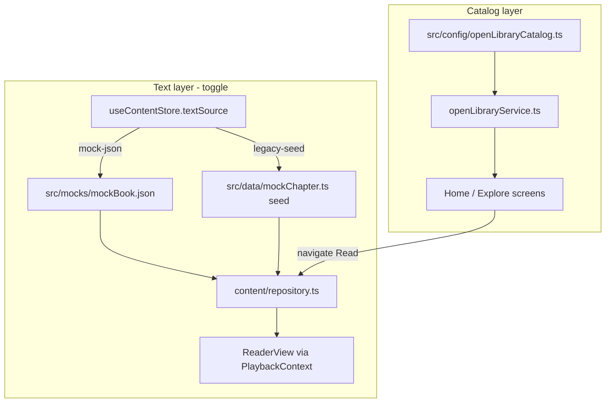

# Open Library Catalog + Local Mock Reading Text

## Goal

Get **real-looking catalog browsing** (titles, authors, covers) via live [Open Library](https://openlibrary.org/developers/api) calls, while **reading text** comes from a checked-in mock file you can edit immediately. Standard Ebooks full-text ingestion and audio stay on the roadmap, not in this slice.



---

## Architecture principles

| Concern | Source (now) | Source (later) |
|---------|--------------|----------------|
| Catalog metadata + covers | Open Library API | Optional Supabase cache / bulk dump |
| Chapter text + sentences | `src/mocks/mockBook.json` | Standard Ebooks ingest pipeline |
| Word timings | Synthetic (`buildChapter`) | WhisperX alignment |
| Audio | Skip / defer | LibriVox + Storage |

**Separation of concerns:** Open Library answers “what books exist in the shelf?” Mock JSON answers “what can I read right now?” Only books present in mock JSON are fully openable in Read mode; other OL catalog entries render in Explore but show a lightweight “text coming soon” state if tapped.

---

## 1. Open Library service

**New file:** [`src/services/openLibrary/openLibraryService.ts`](src/services/openLibrary/openLibraryService.ts)

Responsibilities:

- **`fetchWork(workId: string)`** — `GET https://openlibrary.org/works/{id}.json` + optional `authors` hydration via `/authors/{id}.json`
- **`fetchWorksByIds(workIds: string[])`** — parallel fetch with basic error tolerance (failed work skipped, logged)
- **`buildCoverUrl(opts)`** — wrap `https://covers.openlibrary.org/b/{id|isbn|olid}/{value}-{S|M|L}.jpg` (reuse patterns from [`src/data/bookCovers.ts`](src/data/bookCovers.ts) but driven by OL fields: `covers[0]`, ISBN from edition lookup when needed)
- **`mapWorkToCatalogItem(work, authorName)`** → `BookCatalogItem` + extended fields:
  - `slug` — stable kebab-case from title (same helper used everywhere)
  - `openLibraryWorkId` — store on an extended type or `Book` metadata field
  - `coverImageUrl` from cover id when present; else null → [`BookCoverImage`](src/components/read/BookCoverImage.tsx) fallback colors still work

**Curated list (no bulk dump):** [`src/config/openLibraryCatalog.ts`](src/config/openLibraryCatalog.ts)

```ts
export const OPEN_LIBRARY_WORK_IDS = [
  'OL468431W', // The Great Gatsby (example — verify at implementation)
  // 4–8 more public-domain classics matching current Explore set
];
```

Start with ~5–6 known work IDs (Gatsby, Sherlock, Alice, etc.) so Explore is deterministic without open-ended search. Optional **`searchPublicDomainWorks(query)`** can be added later for dynamic Explore; not required for v1.

**Caching (best practice, minimal):** in-memory + `AsyncStorage` TTL (~24h) keyed by work ID so tab switches don’t refetch. No SQLite/bulk dump.

---

## 2. Local mock book JSON

**New file:** [`src/mocks/mockBook.json`](src/mocks/mockBook.json)

Schema (versioned, easy to hand-edit):

```json
{
  "schema_version": 1,
  "slug": "the-great-gatsby",
  "openLibraryWorkId": "OL468431W",
  "title": "The Great Gatsby",
  "author": "F. Scott Fitzgerald",
  "chapters": [
    {
      "slug": "the-great-gatsby-ch-1",
      "title": "Chapter 1",
      "chapterIndex": 1,
      "pageNumber": 1,
      "paragraphs": [
        "First sentence of the chapter…",
        "Second paragraph as its own sentence block…"
      ]
    }
  ]
}
```

Each `paragraphs[]` entry = one **sentence row** in the reader (matches existing [`buildChapter`](src/data/mockChapter.ts) convention).

**New file:** [`src/services/content/mockContentService.ts`](src/services/content/mockContentService.ts)

- Import JSON (`require('../mocks/mockBook.json')` or `import` with `resolveJsonModule`)
- Validate schema_version
- Reuse extracted **`buildChapterFromParagraphs()`** (move core logic out of `mockChapter.ts` into [`src/utils/chapterBuilder.ts`](src/utils/chapterBuilder.ts)) to produce runtime `Chapter` with synthetic word timings + `syncHash`
- Export:
  - `getMockBook(): Book` — metadata + chapter stubs (no hydrated sentences on list)
  - `fetchMockChapter(bookSlug, chapterSlug): ChapterResponse`
  - `isMockReadableBook(slug): boolean`

Start with **2–3 chapters**, ~8–15 paragraphs each — enough to validate scrolling, TOC, and chapter switch without audio.

---

## 3. Content repository refactor

Update [`src/services/content/repository.ts`](src/services/content/repository.ts) to a clear priority chain:

**Catalog (`fetchCatalog` / `fetchBooks`):**

1. **Open Library** (default) — map curated work IDs → `BookCatalogItem[]` / lightweight `Book[]` (chapter titles from mock JSON when slug matches, else empty `chapters: []`)
2. Fallback: existing `seededBooks` map (offline / OL failure)

**Chapter text (`fetchChapter`):**

1. If `textSource === 'mock-json'` and slug matches mock book → `mockContentService.fetchMockChapter`
2. Else → existing seed path (`fetchChapterFromSeed`) for backward compatibility
3. Supabase path: **keep but deprioritized** — only when `isBackendConfigured()` AND `textSource === 'supabase'` (future flag; default off for this work)

**Remove silent wrong-book fallback:** if `bookSlug` not found, return explicit error / empty state instead of defaulting to Gatsby ([`repository.ts` L50–54](src/services/content/repository.ts)).

**Text-only for now:** in [`PlaybackContext.applyChapter`](src/context/PlaybackContext.tsx), gate `loadChapterAudio` behind `features.audioEnabled` (default `false`) so Read mode doesn’t block on missing MP3 or show audio errors during text-focused testing.

---

## 4. Frontend state + dev toggle

**New Zustand store:** [`src/store/useContentStore.ts`](src/store/useContentStore.ts)

```ts
type TextSource = 'mock-json' | 'legacy-seed';
type CatalogSource = 'openlibrary' | 'local-seed';

interface ContentStore {
  textSource: TextSource;
  catalogSource: CatalogSource;
  setTextSource(source: TextSource): void;
  setCatalogSource(source: CatalogSource): void;
}
```

Persist toggles in `AsyncStorage` (dev convenience).

**Dev UI:** extend [`src/screens/ProfileScreen.tsx`](src/screens/ProfileScreen.tsx) (visible when `__DEV__`) with a **Content sources** card:

- Catalog: Open Library | Local seed
- Reading text: Mock JSON | Legacy seed
- Show active mock book slug + chapter count

**PlaybackContext** reads `useContentStore` when calling `fetchCatalog` / `fetchBooks` / `fetchChapter` (pass source into repository or subscribe in provider).

**Explore / Home** ([`ExploreScreen.tsx`](src/screens/ExploreScreen.tsx), [`HomeScreen.tsx`](src/screens/HomeScreen.tsx)):

- Continue using `books` from context; covers come from OL `coverImageUrl` on each item
- Optional badge on mock-readable book card: “Readable”

**Read entry guard:** if user opens a catalog book without mock text, show [`ReadUnavailableScreen`](src/screens/ReadUnavailableScreen.tsx) (new, small) instead of loading wrong content.

---

## 5. Cover integration cleanup

- [`bookCovers.ts`](src/data/bookCovers.ts) becomes **fallback-only** (colors + slug-based URL when OL cover missing)
- [`BookCoverImage`](src/components/read/BookCoverImage.tsx): prefer `book.coverImageUrl` from OL; keep slug fallback map for offline

---

## 6. Repeatable process (mock now → real later)

| Step | Today (mock) | Later (Standard Ebooks) |
|------|--------------|-------------------------|
| Add book to shelf | Add OL work ID to `openLibraryCatalog.ts` | Same + SE URL in manifest |
| Add readable text | Edit `mockBook.json` chapters/paragraphs | `scripts/ingest/standardEbooks.ts` → generated JSON |
| Build sync asset | `buildChapterFromParagraphs` at runtime | `exportSyncAssets.ts` |
| Publish | Git commit JSON | `seed:supabase` + Storage |
| App reads | `mockContentService` | `repository` + Storage sync JSON |

Document the workflow in [`src/mocks/README.md`](src/mocks/README.md) (short): how to add a paragraph, bump chapter, match slug to OL work ID.

---

## 7. npm scripts (optional, small)

```json
"validate:mock-book": "tsx scripts/validate/mockBookSchema.ts"
```

Validates `mockBook.json` shape + unique slugs before CI.

---

## 8. Out of scope (explicitly deferred)

- Standard Ebooks EPUB/HTML fetch pipeline
- Supabase catalog as primary source (stays optional fallback)
- Open Library bulk MARC/JSON dumps
- Audio load, LibriVox, WhisperX alignment
- Production content-source toggle (dev-only for now)

---

## 9. Verification checklist

- [ ] Explore shows 5+ books with **live OL titles, authors, covers** (airplane mode → falls back gracefully)
- [ ] Dev toggle switches reading text between mock JSON and legacy seed without app restart
- [ ] Opening mock book → full paragraph text in Read mode, chapter TOC works, no audio errors
- [ ] Opening non-mock OL book → “text coming soon”, not Gatsby content
- [ ] `npm run ci` passes after type additions (`openLibraryWorkId` optional on `Book`)
- [ ] Edit one paragraph in `mockBook.json`, reload app, see updated text

---

## Key files to touch

| Action | Path |
|--------|------|
| Create | `src/services/openLibrary/openLibraryService.ts` |
| Create | `src/config/openLibraryCatalog.ts` |
| Create | `src/mocks/mockBook.json`, `src/mocks/README.md` |
| Create | `src/services/content/mockContentService.ts` |
| Create | `src/utils/chapterBuilder.ts` |
| Create | `src/store/useContentStore.ts` |
| Create | `src/screens/ReadUnavailableScreen.tsx` |
| Refactor | `src/services/content/repository.ts` |
| Refactor | `src/context/PlaybackContext.tsx` (catalog load + audio gate) |
| Update | `src/screens/ProfileScreen.tsx` (dev toggle) |
| Update | `src/types/index.ts` (optional `openLibraryWorkId`) |
| Shrink role | `src/data/bookCovers.ts` (fallback only) |
