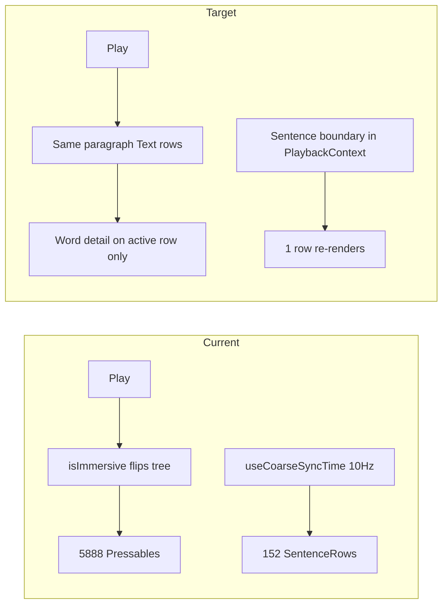
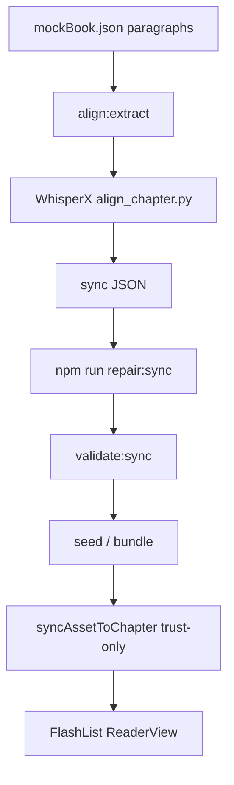

# Read View — Actionable Ticket List

Sequencing: **Path A first, then Path B** (per your choice). Each ticket is sized for a single PR where possible.

**Already partially done** (treat as baseline, not new tickets):
- Single `KaraokeWord` on active word only ([ReaderView.tsx](src/components/ReaderView.tsx))
- All words pressable in immersive mode (seek fix)
- `durationSv` SharedValue in [PlaybackProgressBar.tsx](src/components/read/PlaybackProgressBar.tsx)
- Gap-aware `findActiveWordIndexInSentence` / `findActiveSentenceIndex`
- `@shopify/flash-list@1.7.6` already in [package.json](package.json) (unused in reader)

---

## Phase 1 — Path A: Read view quick wins

Goal: Stop treating the component tree as the sync engine. Stable playback on Gatsby ch.1 without pipeline changes.

### READ-1: Sentence-first highlight (active row only gets word detail)

**Problem:** Immersive mode decomposes every paragraph into ~5,888 `Pressable` nodes ([ReaderView.tsx](src/components/ReaderView.tsx) lines 77–107).

**Work:**
- Default row render: single `Text` (or `Pressable` wrapping full paragraph) with optional sentence-level background highlight when `si === activeSentenceIndex`
- Word-level map + `KaraokeWord` **only** when `si === activeSentenceIndex && isPlaying`
- Past words in active row: orange `Text` (no Reanimated)
- Inactive rows: never subscribe to word index

**Acceptance criteria:**
- Gatsby ch.1 plays through paragraph 3+ without crash or karaoke freeze
- React DevTools / Flipper: component count during play stays O(paragraphs), not O(words)
- Inactive rows do not import or call `findActiveWordIndexInSentence`

**Files:** [ReaderView.tsx](src/components/ReaderView.tsx), possibly extract `ParagraphRow.tsx`

**Depends on:** none

---

### READ-2: Clock isolation (remove 10 Hz re-render storm)

**Problem:** `useCoarseSyncTime(100)` in `ReaderView` passes `syncTimeMs` to all 152 `SentenceRow`s, recomputing `activeWordIndex` 10×/sec on every row.

**Work:**
- Remove parent-level `useCoarseSyncTime` from [ReaderView.tsx](src/components/ReaderView.tsx)
- Active row only: subscribe to coarse time (or derive word index from `activeSentenceIndex` + `progressMs` via a small hook)
- [useSyncEngine.ts](src/hooks/useSyncEngine.ts) keeps 250 ms coarse clock for transport/footer (unchanged)
- Sentence index continues to update from [PlaybackContext.tsx](src/context/PlaybackContext.tsx) `syncActiveSentenceIndex` on audio ticks (~50 ms, JS thread, only on boundary change)

**Acceptance criteria:**
- During playback, only the active paragraph row re-renders on word boundaries (not all 152)
- `activeSentenceIndex` still advances correctly across paragraph gaps

**Files:** [ReaderView.tsx](src/components/ReaderView.tsx), [useCoarseSyncTime.ts](src/hooks/useCoarseSyncTime.ts) (optional: `useActiveRowSyncTime`)

**Depends on:** READ-1

---

### READ-3: Stable render tree (decouple immersive from tree shape)

**Problem:** `setPlaying(true)` forces `isImmersive: true` and swaps plain `Text` → word map ([usePlaybackStore.ts](src/store/usePlaybackStore.ts) lines 54–58).

**Work:**
- Split concerns:
  - `isPlaying` — transport state
  - `isImmersive` — chrome dimming (header/footer dark mode); set true on play, false on pause optional
- Same component structure before and after play; only styles/highlights change
- Chapter change still resets immersive via existing `setChapter`

**Acceptance criteria:**
- Pressing play does not cause a full layout remount of all paragraphs (no tree-shape flip)
- Tap-to-seek behavior identical before and after first play

**Files:** [usePlaybackStore.ts](src/store/usePlaybackStore.ts), [ReaderView.tsx](src/components/ReaderView.tsx), [AudioController.tsx](src/components/AudioController.tsx)

**Depends on:** READ-1

---

### READ-4: Sentence-first seek; word seek secondary

**Problem:** Word-level tap as default is hard to use while scrolling; accidental seeks.

**Work:**
- **Primary:** tap paragraph body → `seekToWord(sentence.words[0].start_ms)` (or sentence `start_ms` from bounds)
- **Secondary:** double-tap a word (or long-press word) → precise word seek
- Keep scrubber + skip-15 as coarse navigation ([PlaybackTransport.tsx](src/components/read/PlaybackTransport.tsx))
- Update [ReaderView.tsx](src/components/ReaderView.tsx) press handlers; document gesture in code comment

**Acceptance criteria:**
- Single tap on any paragraph seeks to that paragraph start and starts playback
- Double-tap word seeks to that word
- No regression on bookmark long-press (sentence action popover)

**Files:** [ReaderView.tsx](src/components/ReaderView.tsx), [PlaybackContext.tsx](src/context/PlaybackContext.tsx) (`seekToWord` unchanged)

**Depends on:** READ-1, READ-3

---

### READ-5: Smart follow-scroll

**Problem:** [ReaderView.tsx](src/components/ReaderView.tsx) scrolls on every `activeSentenceIndex` change, fighting manual scroll.

**Work:**
- Add `followMode` to [usePlaybackStore.ts](src/store/usePlaybackStore.ts) (default `true`)
- Track user scroll: `onScrollBeginDrag` → pause follow for ~8 s (or until toggle)
- Auto-scroll only when `followMode && activeSentenceIndex` row is outside viewport (measure via `onLayout` + scroll offset ref)
- Optional: small UI affordance in read footer to toggle follow (can be READ-5b follow-up)

**Acceptance criteria:**
- Manual scroll during playback is not overridden for 8 s
- With follow on, active paragraph stays visible when it would leave viewport
- Bookmark jump (`scrollToSentenceIndex`) still scrolls immediately

**Files:** [ReaderView.tsx](src/components/ReaderView.tsx), [usePlaybackStore.ts](src/store/usePlaybackStore.ts)

**Depends on:** none (can parallel READ-2)

---

### READ-6: Phase 1 QA gate

**Work:**
- Manual test script on iOS: Gatsby ch.1 — play from start, skip via paragraph tap, scrubber, paragraph 3 karaoke, follow-scroll override
- Add one integration-style test: `ReaderView` active row only renders word map (component test or snapshot with mock chapter)
- Run `npm run ci`

**Acceptance criteria:** All Phase 1 tickets verified on device; CI green

**Depends on:** READ-1 through READ-5

---

## Phase 2 — Path B: Sync pipeline + virtualized reader

Goal: Trustworthy sync data offline; reader scales to full books.

**Note:** [extractChapterAlignInput.ts](scripts/alignment/extractChapterAlignInput.ts) already emits **one block per `mockBook.json` paragraph** (152 for Gatsby ch.1). Phase 2 focuses on validation, offline repair, re-seed, and list virtualization—not re-extracting paragraphs.

### SYNC-1: Sync block validation and long-paragraph policy

**Work:**
- Extend [validateSyncAsset.ts](scripts/alignment/validateSyncAsset.ts):
  - Assert block count matches text asset paragraph count (when text JSON available)
  - Warn/error when any block exceeds `MAX_WORDS_PER_BLOCK` (e.g. 80) — Gatsby s-2 will flag
- Document in [scripts/alignment/whisperx/README.md](scripts/alignment/whisperx/README.md): 1 block = 1 paragraph; long paragraphs are expected for literary text
- Optional follow-up ticket: split long paragraphs at sentence boundaries in extract (only if validation blocks release)

**Acceptance criteria:** `npm run validate:sync` reports word-count stats per block; CI fails on block/paragraph count mismatch

**Depends on:** Phase 1 complete (recommended)

---

### SYNC-2: Offline-only repair (runtime trust committed JSON)

**Problem:** [syncAssetToChapter](src/utils/syncAsset.ts) calls `repairSyncAsset()` on every chapter load—non-deterministic, risky.

**Work:**
- Remove runtime `repairSyncAsset` from `syncAssetToChapter`; expand minified JSON only
- Keep repair in [repairSyncAsset.ts](scripts/alignment/repairSyncAsset.ts) + `npm run repair:sync` as build step
- Add runtime guard: if `timeline_coords !== 'visual'` or `hasTimelineGap`, log error and refuse karaoke (or show banner)
- Bump `sync_version` / re-hash Gatsby ch.1 after repair
- Update [syncTimelineRepair.test.ts](src/tests/syncTimelineRepair.test.ts) and any tests assuming runtime repair

**Acceptance criteria:**
- Same visual timings before/after for repaired Gatsby asset
- App never mutates sync JSON in memory on load
- `npm run ci` green

**Files:** [syncAsset.ts](src/utils/syncAsset.ts), [syncTimelineRepair.ts](src/utils/syncTimelineRepair.ts), [assets/sync/the-great-gatsby/ch-1.json](assets/sync/the-great-gatsby/ch-1.json)

**Depends on:** SYNC-1

---

### SYNC-3: Re-run alignment pipeline for Gatsby ch.1

**Work:**
- `npm run repair:sync` on committed asset
- Verify `audio_offset_ms`, sentence boundaries, `validate:sync` clean
- Update bundled asset + Supabase seed if used; invalidate sync hash in cache manifest
- Document in [ARCHITECTURE.md](ARCHITECTURE.md) § sync pipeline

**Acceptance criteria:** Fresh install + `-c` cache clear plays Gatsby ch.1 with correct intro skip and seek

**Depends on:** SYNC-2

---

### READ-7: Virtualized ReaderView (FlashList v1)

**Work:**
- Replace `ScrollView` with `@shopify/flash-list` v1.7.6 in [ReaderView.tsx](src/components/ReaderView.tsx)
- `estimatedItemSize` from measured paragraph heights (fallback ~120)
- `scrollToIndex` for follow-scroll and bookmark jump (replace Y-offset `sentenceLayouts` map)
- Preserve READ-1 rules: word detail only on active visible row
- Test on iOS without New Architecture (Expo 53 default)

**Acceptance criteria:**
- Chapter open time improves vs ScrollView (subjective: no multi-second stall)
- Follow-scroll and bookmark jump still work via `scrollToIndex`
- No FlashList v2 / New Architecture requirement

**Depends on:** READ-1, READ-5, SYNC-2 (runtime stable before perf work)

---

### READ-8: Phase 2 QA gate

**Work:**
- Full chapter playback test Gatsby ch.1 end-to-end
- Add `validate:sync` to [.github/workflows/ci.yml](.github/workflows/ci.yml) (currently only in local `npm run ci` per [ARCHITECTURE.md](ARCHITECTURE.md))
- Update [docs/READ_VIEW_DESIGN_REVIEW.md](docs/READ_VIEW_DESIGN_REVIEW.md) with "implemented" status

**Depends on:** SYNC-1 through READ-7

---

## Phase 3 — Backlog (P3, not scheduled)

Track as future epics; do not start until Phase 2 ships.

| Ticket | Summary | Key files |
|--------|---------|-----------|
| **READ-9** | Unified Read/Listen screen (no `ReadScreen` mode swap) | [ReadScreen.tsx](src/screens/ReadScreen.tsx), [AudiobookListenView.tsx](src/components/read/AudiobookListenView.tsx) |
| **READ-10** | Skia/canvas word fill on active row only (replace dual-layer KaraokeWord) | [KaraokeWord.tsx](src/components/KaraokeWord.tsx), new Skia dependency |
| **ARCH-1** | Split PlaybackContext (~700 lines) into transport / chapter / bookmarks | [PlaybackContext.tsx](src/context/PlaybackContext.tsx) |
| **SYNC-4** | Schema alias `paragraph_index` on sync blocks (optional rename with migration) | [syncAsset.ts types](src/types/syncAsset.ts), pipeline scripts |
| **SYNC-5** | Sentence-boundary split for blocks over N words (alignment UX) | [extractChapterAlignInput.ts](scripts/alignment/extractChapterAlignInput.ts), [align_chapter.py](scripts/alignment/whisperx/align_chapter.py) |

---

## Suggested PR order (Phase 1)

1. READ-1 (biggest stability win)
2. READ-2 + READ-3 (can combine in one PR)
3. READ-4
4. READ-5
5. READ-6

**Estimated Phase 1 effort:** 3–5 PRs, ~3–5 days.

**Estimated Phase 2 effort:** 4–5 PRs, ~1–2 weeks (includes optional GPU re-align if WhisperX output changes).

---

## Out of scope for these tickets

- Expo New Architecture / FlashList v2 upgrade
- Full book catalog alignment (only Gatsby ch.1 pipeline hardening)
- Listen mode redesign (Phase 3 READ-9)
