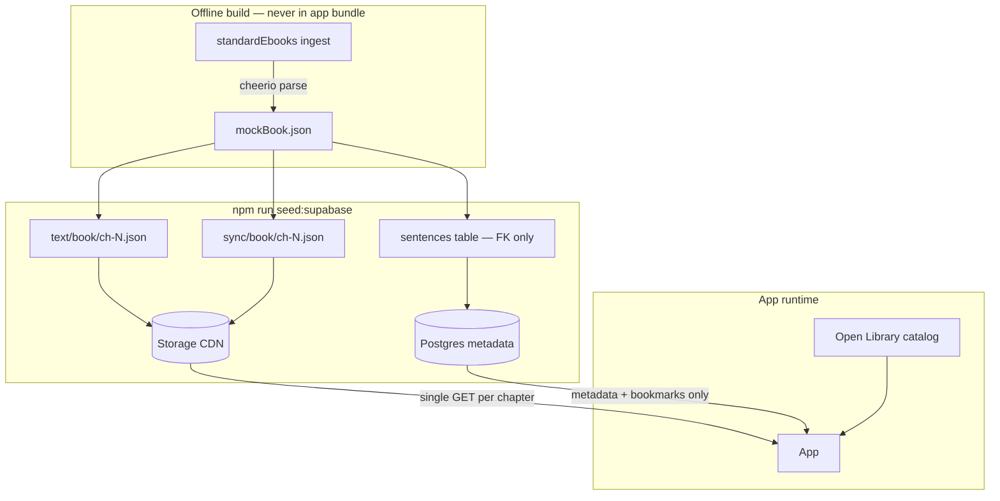

# Readr MVP Roadmap (Production-First)

## Architecture: what is production vs dev-only



| Layer | Production | Dev fallback |
|-------|------------|--------------|
| **Catalog browse** | Open Library API | `local-seed` toggle |
| **Chapter text (runtime)** | **Storage `text/` JSON** — one fetch per chapter, cached locally | Bundled `mockBook.json` |
| **Word timings (runtime)** | Storage `sync/` JSON — only when audio enabled | Synthetic (`chapterBuilder`) |
| **Audio** | Storage `audio/` bucket | `demo-chapter.mp3` (ch.1 only) |
| **DB `sentences` table** | **Seed-time only** — stable IDs for bookmark FKs | Not queried on chapter open |
| **DB `books` / `chapters`** | Light metadata (slug, paths, hashes) | — |
| **Bookmarks** | Supabase `user_highlights` + offline queue | AsyncStorage cache |
| **Auth** | Supabase email OTP | Dev guest (`__DEV__` only) |

**Key insight:** `mockBook.json` is an **ingest artifact**. The app never parses EPUB. At runtime it never SELECTs hundreds of sentence rows—it streams a pre-compiled JSON file from Storage (same cache pattern as sync assets today).

---

## Validated strengths (keep as-is)

1. **Hybrid DB vs Storage** — Postgres for relational user state; Storage/CDN for heavy static payloads.
2. **Failsafe routing** — `textSource: supabase` when keys exist; fall back to `mock-json` when not seeded or offline dev.
3. **Offline ingest** — EPUB parsing stays in Node scripts, not the mobile bundle.

---

## Phase 1 risks & fixes (from stress test)

### A. Standard Ebooks HTML parsing

**Risk:** Naive regex pulls raw tags (`<em>`, `<a>`) into paragraph strings.

**Fix (Phase 1a):**
- Use **cheerio** (or equivalent DOM parser) on SE XHTML spine files.
- Extract `<p>` (and blockquote `<p>` inside `<blockquote>`) via `.text()` / `.textContent` — never `.html()`.
- Normalize whitespace and unicode dashes; drop empty nodes.
- **Gate:** open generated `mockBook.json` in editor; spot-check ch. 1, 5, 9 for tag leakage before any cloud seed.

### B. Runtime sentence row fetch (critical — plan correction)

**Risk:** `fetchChapterFromSupabase` currently falls back to `SELECT * FROM sentences` — hundreds of rows per chapter over mobile HTTP.

**Fix (Phase 1b):**
- Add Storage bucket **`text`** (public read, same as `sync`).
- Seed uploads `text/{bookSlug}/ch-{n}.json` per chapter:

```json
{
  "schema_version": 1,
  "chapter_slug": "the-great-gatsby-ch-1",
  "sentences": [
    { "id": "the-great-gatsby-ch-1-s-0", "index": 0, "text": "In my younger...", "page_number": 1 }
  ]
}
```

- Add `text_metadata_path` + `text_hash` on `chapters` (migration) for cache invalidation.
- App: `loadChapterTextAsset()` mirrors existing `loadChapterSyncAsset()` — one GET, AsyncStorage cache, hash check.
- **`sentences` table:** bulk upsert at seed time only (bookmark FK to `sentence_id`). Remove runtime sentence queries from `supabaseContent.ts`.

### C. Seed ordering & foreign keys

**Risk:** Child rows before parent book/chapter → FK violations.

**Fix:** Seed script order is strict and idempotent:

1. `books` upsert (stable `slug`, optional `open_library_work_id` aligned with OL catalog)
2. `chapters` upsert (metadata + storage paths)
3. Storage upload (`text/`, `sync/`, `audio/`, `covers/`)
4. `sentences` bulk upsert (IDs must match text JSON `id` fields)

Open Library sync is **not** a prerequisite — ingest metadata defines the book row; OL is browse-only.

---

## Phase 1 — split into two micro-steps

### Phase 1a — Local extraction (no cloud)

**Goal:** Pristine `mockBook.json` with all 9 Gatsby chapters.

| Task | Detail |
|------|--------|
| Ingest script | `scripts/ingest/standardEbooks.ts` + `scripts/ingest/runGatsby.ts` |
| Parser | cheerio on SE EPUB spine XHTML |
| Output | `src/mocks/mockBook.json` |
| Command | `npm run ingest:gatsby` |
| Validate | `npm run validate:mock-book` |
| Human gate | Read JSON in editor — no HTML tags, 9 chapters, sensible paragraph breaks |

**Done when:**
- [ ] 9 chapters, 0 HTML tag leakage in spot check
- [ ] Validator passes

**Do not run seed until 1a gate passes.**

---

### Phase 1b — Cloud streaming

**Goal:** App reads Gatsby from Supabase Storage, not mock or row-by-row SQL.

| Task | Detail |
|------|--------|
| Migration | `004_text_storage.sql` — `text` bucket + `chapters.text_metadata_path`, `text_hash` |
| Seed | Extend `supabaseSeed.ts` — emit/upload text JSON; keep sentence upsert for FKs |
| App | `fetchChapterFromSupabase` → Storage text asset first; sync asset when audio on |
| Remove | Runtime `fetchSentencesForChapter` path |

| Task | Command |
|------|---------|
| Migrate | Supabase CLI or dashboard |
| Seed | `npm run seed:supabase` |
| Verify | Gatsby readable with `textSource: supabase`, no Mock JSON toggle |

**Done when:**
- [ ] 9 chapters in Storage + metadata in DB
- [ ] Chapter open = 1 Storage GET (check network tab / logs)
- [ ] `npm run ci` green

---

## Already done (`p0-prod-wiring` — partial)

| Done | Still needs 1b |
|------|----------------|
| `textSource` defaults to supabase when configured | Storage-first chapter load |
| Seed from `mockBook.json` via `chapterBuilder` | Upload `text/` JSON |
| `canReadBook` via readable slugs | — |
| Profile Supabase toggle | — |
| DB sentence runtime fallback | **Remove** |

---

## Phase 2 — Auth + bookmarks

Bookmarks reference `sentences.id` — satisfied by seed-time sentence rows (Phase 1b step 4). No change to FK model.

1. Custom SMTP + OTP template (`{{ .Token }}`)
2. E2E bookmark persistence with real account

---

## Phase 3 — Audio demo

- `sync/` + `audio/` buckets for Gatsby ch.1 only
- Karaoke uses sync JSON; text still from `text/` JSON

---

## Phases 4–6

Unchanged — unavailable UX, auth audit, second book ingest.

---

## Quick reference

| Command | When |
|---------|------|
| `npm run ingest:gatsby` | Phase 1a — local EPUB → mockBook.json |
| `npm run validate:mock-book` | After ingest; before seed |
| `npm run seed:supabase` | Phase 1b — after migrations + manual JSON review |
| `npm run ci` | Before closing Phase 1 |

## Suggested order

1. **1a** — ingest + human verify (local only)
2. **1b** — migration + storage-first app path + seed
3. **Phase 2** — auth + bookmarks
4. **Phase 3** — audio/karaoke

## Dev toggles

If Supabase is configured but not seeded, use Profile → **Mock JSON** until 1b completes.
