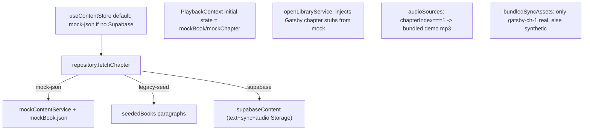
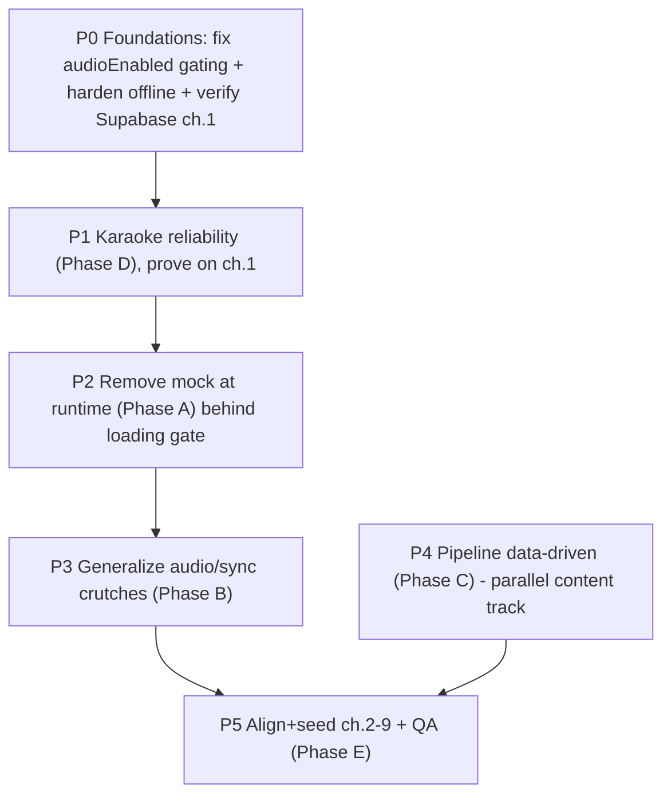

# Readr: Supabase-Only Reading + Audio Core

## Goal

Make Supabase the single source of truth for all reading/audio data, remove every mock/seed/fallback crutch, generalize the alignment pipeline to be data-driven, harden karaoke, and prove it on the full Gatsby book.

## Guiding principles

- Supabase is the ONLY runtime content source. `mockBook.json` survives ONLY as an offline pipeline ingest artifact (the seed + align scripts read it), never imported by `src/` runtime.
- Nothing keys off `chapterIndex === 1`. Audio/sync/offset come from DB rows + Storage for every chapter.
- One explicit, slug-keyed offline fallback (Gatsby ch.1 text+sync) is retained for resilience - this is NOT mock data and NOT an index check.
- Each step must keep `npm run ci` green and the app launchable (Gatsby still plays from Supabase) before moving on.
- Fix foundations before deleting: prove Supabase-only works great on ONE chapter before removing the known-good mock path.

## Stress-test findings baked into this revision

- REGRESSION TRAP: `[src/services/content/supabaseContent.ts](src/services/content/supabaseContent.ts)` only loads real WhisperX timings when `audioEnabled` is true (`applySyncTimings` is gated), and `audioEnabled` defaults false; the mock path applies sync unconditionally. Removing mock without fixing this makes karaoke WORSE. Fixed first in P0.
- CONNECTIVITY CLIFF: `[src/services/sync/textCache.ts](src/services/sync/textCache.ts)` has no bundled fallback and `downloadAsync` is not wrapped - first offline open throws. Hardened in P0; slug-keyed bundled ch.1 retained.
- BLAST RADIUS: 16 components consume `usePlayback`/`usePlaybackSession`. A3 uses a loading gate at `AppShell`/navigation instead of making every consumer null-safe.
- SEQUENCING: GPU alignment of ch.2-9 is decoupled into a parallel content-ops track (P4/P5) so the refactor is provable on ch.1 alone.

## Current data flow (to dismantle)

Target: every arrow except `supabase` is removed; `PlaybackContext` starts from a loading/empty session; one slug-keyed bundled fallback remains for offline.

## Execution order

---

## P0 - Foundations (do FIRST, before any deletion)

### P0.1 Fix the sync-timing gating (karaoke regression guard)
- `[src/services/content/supabaseContent.ts](src/services/content/supabaseContent.ts)`: in `hydrateChapterFromSupabase`, load real sync timings whenever `dbChapter.sync_hash` exists - remove the `audioEnabled &&` condition from `applySyncTimings`. `audioEnabled` should gate only audio playback, not whether karaoke timings are present.

### P0.2 Harden offline + keep slug-keyed bundled fallback
- `[src/services/sync/textCache.ts](src/services/sync/textCache.ts)`: wrap `downloadAsync` in try/catch; on failure fall back to the cached file if present, else a bundled text asset (Gatsby ch.1). Mirror the existing pattern in `[src/services/sync/cache.ts](src/services/sync/cache.ts)`.
- `[src/data/bundledSyncAssets.ts](src/data/bundledSyncAssets.ts)`: keep `the-great-gatsby-ch-1` bundled sync as an explicit, slug-keyed offline fallback (used by cache fallback), decoupled from any index check.

### P0.3 Verify Supabase ch.1 end-to-end
- Confirm Supabase has Gatsby book + ch.1 row + `text/`, `sync/`, `audio/` Storage objects. With mock paths force-disabled, confirm ch.1 plays audio AND shows real (not synthetic) karaoke. This is the go/no-go gate for P2.

---

## P1 - Karaoke + sync reliability (Phase D, isolated, prove on ch.1)

### D1. FlashList correctness
- `[src/components/ReaderView.tsx](src/components/ReaderView.tsx)`: differentiate `getItemType` for static vs active-karaoke rows (or disable recycling for the active index) to stop cell-reuse glitches; actually USE `visibleIndicesRef` to skip redundant `scrollToIndex`; verify measured heights for tall karaoke rows.

### D2. Stabilize row swap + clock lag
- `[src/components/read/ParagraphRow.tsx](src/components/read/ParagraphRow.tsx)`: smooth the `StaticParagraphRow` <-> `ActiveKaraokeParagraphRow` remount (stable keys/heights). Reduce span/word index lag by driving it from `progressMs` faster on the active row instead of the 100 ms `useCoarseSyncTime`.
- `[src/context/PlaybackContext.tsx](src/context/PlaybackContext.tsx)`: apply `playbackRate` in the `useFallbackClock` tick (currently fixed 16 ms step).

---

## P2 - Supabase as single source of truth (Phase A, remove mock at runtime)

### A1. Collapse content sources
- `[src/store/useContentStore.ts](src/store/useContentStore.ts)`: remove `mock-json` and `legacy-seed` from `TextSource`; `textSource` is always `supabase`. Drop `defaultTextSource()` mock branch. Decide catalog: Supabase books as primary, Open Library as optional metadata enrichment only.
- `[src/screens/ProfileScreen.tsx](src/screens/ProfileScreen.tsx)`: remove the `__DEV__` text-source/catalog toggles and `getMockBookMetadata()` display.

### A2. Repoint the repository
- `[src/services/content/repository.ts](src/services/content/repository.ts)`: `fetchChapter` -> Supabase only (throw `ChapterNotFoundError` if missing, no seed/mock branch). `fetchCatalog`/`fetchBooks` -> Supabase (`fetchBooksFromSupabase`, wire in unused `fetchCatalogFromSupabase`). `canReadBook`/`refreshReadableBookSlugs` -> `fetchReadableBookSlugsFromSupabase`. Remove `seededBooks`, `fetchChapterFromSeed`, `hydrateChapterFromSeed`, `mapCatalogFromSeed`, `LEGACY_BOOK_SLUGS`.

### A3. Remove mock initial state from playback (via loading gate)
- Add a loading gate at `AppShell`/navigation (and `[src/hooks/useReadSession.ts](src/hooks/useReadSession.ts)`) so reading screens mount only once a real `book`/`chapter` is loaded - this keeps the ~16 `usePlayback` consumers non-null without auditing each.
- `[src/context/PlaybackContext.tsx](src/context/PlaybackContext.tsx)`: replace `mockBook`/`mockChapter` initial React state with a loading/empty session (`book`/`chapter` nullable + `isLoadingChapter`). Update `stopSessionForSignOut` to reset to empty instead of `mockChapter`.

### A4. Open Library cleanup
- `[src/services/openLibrary/openLibraryService.ts](src/services/openLibrary/openLibraryService.ts)`: remove the Gatsby chapter-stub injection via `getMockChapterStubs()`. OL returns catalog metadata only; chapter lists come from Supabase.

### A5. Retire mock modules + fix tests
- Delete runtime mock consumers: `[src/services/content/mockContentService.ts](src/services/content/mockContentService.ts)`, and the `seededBooks`/`mockBook`/`mockChapter` exports in `[src/data/mockChapter.ts](src/data/mockChapter.ts)` (keep only what scripts need, or move to `scripts/`).
- Keep `[src/mocks/mockBook.json](src/mocks/mockBook.json)` as a pipeline-only artifact (seed + align read it). Confirm no `src/` import remains.
- Update `[src/tests/syncEngine.test.ts](src/tests/syncEngine.test.ts)` and `[src/tests/bookmarkFlow.test.ts](src/tests/bookmarkFlow.test.ts)` to build local fixtures instead of importing `mockChapter`/`seededBooks`.

---

## P3 - Generalize audio + sync runtime (Phase B, kill ch.1 crutches)

### B1. Audio resolution is DB-driven
- `[src/services/content/audioSources.ts](src/services/content/audioSources.ts)`: remove the `chapterIndex === 1` bundled-demo branch. Resolve from Supabase Storage via `audioPath` for all chapters. Any offline bundle is a single explicit slug-keyed map, not an index check.
- `[src/utils/chapterAudio.ts](src/utils/chapterAudio.ts)`: `chapterHasPlayableAudio` returns based on `chapter.audioPath` presence, not `chapterIndex === 1`.

### B2. Offset from DB, bundle only as offline fallback
- `[src/data/chapterMediaOverrides.ts](src/data/chapterMediaOverrides.ts)`: remove the static slug->offset map and the `resolveAudioOffsetMs` call sites in `[src/services/content/supabaseContent.ts](src/services/content/supabaseContent.ts)` (lines using it in `mapDbChapter`/`applySyncTimings`). Use `row.audio_offset_ms` directly. If corrections are needed, store them in a DB column, not a TS map.
- `[src/data/bundledSyncAssets.ts](src/data/bundledSyncAssets.ts)`: retains ONLY the slug-keyed Gatsby ch.1 offline fallback from P0.2 (no synthetic generation for other chapters at runtime).

### B3. Trust + surface sync readiness
- Ensure `normalizeSyncAssetForRuntime` / `syncReady` in `[src/utils/syncAsset.ts](src/utils/syncAsset.ts)` is applied for Supabase-loaded chapters, and surface `syncReady === false` in the reader (currently karaoke just silently disables in `[src/components/ReaderView.tsx](src/components/ReaderView.tsx)`). Do NOT re-block audio on it.

---

## P4 - Make the alignment pipeline data-driven (Phase C, parallel content track)

### C1. Manifest from data
- `[scripts/alignment/chapterMediaManifest.ts](scripts/alignment/chapterMediaManifest.ts)`: generate entries for ALL chapters of a book (derive paths from `{bookSlug}` + `chapterIndex`) instead of one hand-edited row. Drive from `mockBook.json` chapter list (or a small books manifest).

### C2. Real LibriVox per-chapter audio fetcher
- Flesh out `[scripts/ingest/librivox.ts](scripts/ingest/librivox.ts)` (currently scaffold) into a downloader that pulls each Gatsby chapter MP3 to `assets/audio/{book}/ch-{n}.mp3`. Add an npm script.

### C3. Batch align/repair/validate
- Extend `[scripts/alignment/runChapterPipeline.ts](scripts/alignment/runChapterPipeline.ts)` to iterate a whole book's chapters: `align:extract` -> (WhisperX Colab per chapter, manual GPU) -> `repair:sync` -> `validate:sync`. Document the Colab loop in `scripts/alignment/whisperx/COLAB.md`.

---

## P5 - Prove on full Gatsby + QA (Phase E, content-ops)

### E1. Align + seed all 9 chapters
- Run Phase C pipeline for Gatsby ch.2-9, commit sync JSON, `npm run seed:supabase` so DB + Storage hold text/sync/audio for every chapter.

### E2. Generalize verification
- Replace single-chapter `[scripts/verify/readViewGatsbyCh1.ts](scripts/verify/readViewGatsbyCh1.ts)` with a parameterized verifier (any book/chapter): block counts, sentence spans, row-height sanity, `syncReady`.
- `npm run ci` green; manual QA: open Gatsby chapters 1-9, confirm audio + karaoke + follow-scroll + sentence seek with NO mock data and Supabase as the only source.

---

## Risks / notes

- BIGGEST RISK (now mitigated): the `audioEnabled` gating on `applySyncTimings` would have regressed karaoke when mock was removed. P0.1 fixes it before any deletion.
- A3 (removing mock initial state) is the riskiest deletion - mitigated with a loading gate at `AppShell`/navigation rather than null-checking 16 consumers.
- Connectivity: first online load caches text+sync to FileSystem; a slug-keyed bundled Gatsby ch.1 keeps the app demoable fully offline. Do not go network-only.
- "Full Gatsby with real audio" depends on GPU WhisperX runs (Colab) per chapter - decoupled into P4/P5 content-ops so it never blocks the P0-P3 refactor.
- Do NOT re-block audio on `syncReady` (regression from a prior session); surface it in UI instead.
- Keep each phase shippable: after P0-P3 the app must play Gatsby ch.1 purely from Supabase (with real karaoke) before aligning the rest.

## Definition of done per milestone

- P0 done: Supabase ch.1 shows REAL karaoke with `audioEnabled` independent of timings; offline open does not throw.
- P1 done: karaoke smooth through long blocks on ch.1, follow-scroll/seek reliable, no recycling glitches.
- P2-P3 done: zero `src/` imports of mock/seed modules; app runs Supabase-only; one slug-keyed offline fallback remains; `npm run ci` green.
- P5 done: Gatsby ch.1-9 all play with real audio + karaoke from Supabase.