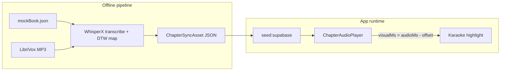
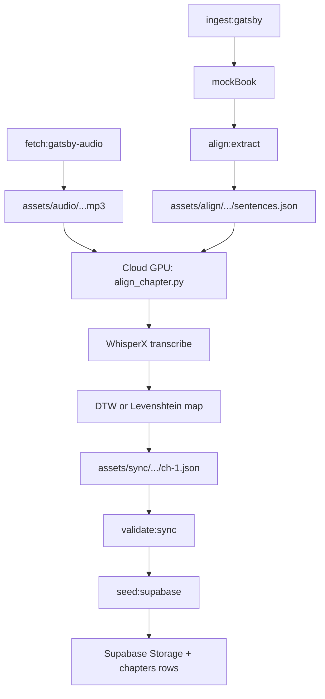

# WhisperX + offset pipeline (MVP production)

## Problem today

| Layer | Current behavior | Issue |
|-------|------------------|-------|
| Seed | [`buildChapterFromMockDef`](scripts/seed/supabaseSeed.ts) always uses synthetic word spacing from [`buildChapterFromParagraphs`](src/utils/chapterBuilder.ts) with `audioOffsetMs: 0` | Uploaded sync JSON does not match LibriVox audio |
| Align | [`align_chapter.py`](scripts/alignment/whisperx/align_chapter.py) is a stub | No real word timings |
| Player | [`ChapterAudioPlayer.load`](src/services/audio/chapterPlayer.ts) starts at file position 0 | Disclaimer plays while karaoke highlights word 0 |
| Offset | Hardcoded `DEFAULT_LIBRIVOX_OFFSET_MS = 18_000` in legacy mock data | Not measured; wrong for current seed path |

## Target architecture

**Single source of truth by artifact type:**

- **Text:** [`src/mocks/mockBook.json`](src/mocks/mockBook.json) → Storage `text/{book}/ch-{n}.json` (unchanged)
- **Audio:** local fetch → Storage `audio/{book}/ch-{n}.mp3` (ch.1 only for MVP)
- **Sync:** WhisperX output → committed [`assets/sync/{book}/ch-{n}.json`](assets/sync/) → Storage `sync/{book}/ch-{n}.json`
- **Metadata:** `chapters.audio_offset_ms`, `sync_hash`, `duration_ms` derived from aligned sync at seed time

**Coordinate contract (lock in for all new sync assets):**



- `audio_offset_ms` = **file seek position (ms)** where playback should start — derived as `first_matched_word_start - 250ms` pre-roll (not manually guessed). Visual timeline still anchors at first spoken word (`s === 0`).
- Word times `{ s, e }` in sync JSON = **visual timeline** (0 = first spoken word of chapter text)
- Player seeks to `audio_offset_ms` on load so playback and highlighting start together
- Keep [`usesLegacyAudioWordTimings`](src/utils/syncAsset.ts) for old bundled mock data only; new WhisperX output never uses legacy coords

## Pipeline stages (scalable, chapter-agnostic)



### 1. Chapter media manifest (small, explicit)

Add [`scripts/alignment/chapterMediaManifest.ts`](scripts/alignment/chapterMediaManifest.ts) — one registry for which chapters have real audio + alignment:

```typescript
{
  bookSlug: 'the-great-gatsby',
  chapterIndex: 1,
  audioLocalPath: 'assets/audio/gatsby-ch1-librivox.mp3',
  alignInputPath: 'assets/align/the-great-gatsby/ch-1-sentences.json',
  syncOutputPath: 'assets/sync/the-great-gatsby/ch-1.json',
}
```

Used by: extract script, validation, seed (audio upload + sync preference). Adding ch.2 later = one manifest row + fetch URL, no seed logic changes.

### 2. Extract alignment input (Node)

New script [`scripts/alignment/extractChapterAlignInput.ts`](scripts/alignment/extractChapterAlignInput.ts):

- Read `mockBook.json` for a chapter slug/index
- Emit JSON matching stable sentence IDs (`{slug}-s-{index}` from [`chapterBuilder.ts`](src/utils/chapterBuilder.ts) / [`textAsset.ts`](src/utils/textAsset.ts)):

```json
{
  "chapter_slug": "the-great-gatsby-ch-1",
  "sentences": [
    { "id": "the-great-gatsby-ch-1-s-0", "index": 0, "text": "In my younger..." }
  ]
}
```

- npm script: `align:extract` (default: Gatsby ch.1 from manifest)

### 3. WhisperX aligner (Python — cloud GPU)

Implement [`scripts/alignment/whisperx/align_chapter.py`](scripts/alignment/whisperx/align_chapter.py) as a **self-contained cloud job** (Colab / RunPod):

**Inputs:** `--audio`, `--sentences` (JSON above), `--out`, `--chapter-slug`, optional `--pre-roll-ms` (default `250`)

**Critical constraint — WhisperX does not natively forced-align arbitrary reference text.** WhisperX transcribes audio into its own word stream, then aligns *those* words to timestamps. Reference text from `sentences.json` may differ in punctuation, contractions, or tokenization (e.g. reference `"He said, 'Wait!'"` vs transcript `"He said wait"`). A naive 1:1 index map will desync karaoke from on-screen text.

**Required approach — transcribe freely, then fuzzy-map back to reference:**

1. Load audio with WhisperX
2. **Transcribe + align** (e.g. `large-v2` or `medium` on GPU): run `model.transcribe()` then `whisperx.align()` to obtain WhisperX word list with file-coordinate `{ start, end, word }` timestamps
3. **Tokenize reference text** from `sentences.json` into a flat ordered list of reference tokens (one per on-screen word), preserving sentence boundaries and stable IDs
4. **Normalize both sides** before matching: lowercase, strip punctuation, NFKC unicode, collapse whitespace
5. **Map WhisperX words → reference words** using a fuzzy sequence-alignment algorithm:
   - Preferred: **DTW** (Dynamic Time Warping) on token sequences — handles insertions, deletions, and unequal lengths
   - Acceptable alternative: **Levenshtein** / Needleman–Wunsch with gap penalties
   - For each reference token, assign timestamps from its matched WhisperX token(s); for gaps (unmatched reference words), interpolate between neighboring matched timestamps or fail loud if gap rate exceeds threshold
6. **Output invariant:** final `ChapterSyncAsset` word arrays must use **exact reference tokens** from `sentences.json` (`w` field matches reference text split), with **exactly one entry per reference word** — array length always matches reference text, never WhisperX transcript length
7. **Derive offset with pre-roll buffer:**
   - `raw_chapter_start_ms` = file start of first matched reference word (sentence 0, word 0)
   - `audio_offset_ms = max(0, raw_chapter_start_ms - pre_roll_ms)` where `pre_roll_ms` defaults to **250** (200–300ms range) — avoids cutting off the first syllable and preserves natural breath/room tone after the LibriVox disclaimer
   - Fail if first mapped token doesn’t fuzzy-match start of sentence 0 (guards wrong edition / bad audio)
8. **Normalize to visual timeline:**
   - Anchor normalization to `raw_chapter_start_ms` (when the first word is spoken): `s = file_start - raw_chapter_start_ms`, `e = file_end - raw_chapter_start_ms`
   - First reference word has `s === 0`; player seeks to `audio_offset_ms` (250ms earlier in the file)
   - Sentence `start_ms` / `end_ms` from first/last word in each sentence block
9. Emit valid [`ChapterSyncAsset`](src/types/syncAsset.ts): `schema_version: 1`, `sync_version: 2`, `audio_offset_ms`, minified `{ w, s, e }`, no `_stub`
10. Emit alignment stats sidecar (optional JSON next to `--out`): match rate, gap count, unmatched WhisperX tokens — for Colab QA

**Deliverables for cloud workflow:**

- [`scripts/alignment/whisperx/requirements.txt`](scripts/alignment/whisperx/requirements.txt) — pinned `whisperx`, `torch`, plus DTW helper if not stdlib (e.g. `rapidfuzz` for token similarity scores inside DTW cost matrix)
- [`scripts/alignment/whisperx/COLAB.md`](scripts/alignment/whisperx/COLAB.md) — upload audio + sentences JSON, run script, download `ch-1.json`, place in `assets/sync/the-great-gatsby/ch-1.json`
- Optional: minimal `.ipynb` or copy-paste Colab cells (same commands as CLI)

**Not in repo:** `.venv`, GPU weights cache, generated audio (already gitignored).

### 4. Validate sync (Node — runs locally + CI)

New [`scripts/alignment/validateSyncAsset.ts`](scripts/alignment/validateSyncAsset.ts):

- Schema checks: required fields, monotonic word times, non-empty words
- **Cross-check vs text:** sentence count + IDs match extract input; reconstructed sentence text from `w` tokens matches reference (normalize whitespace / unicode dashes)
- **Offset sanity:** `audio_offset_ms > 0` for LibriVox ch.1; `audio_offset_ms <= first_word.s` (pre-roll buffer present); first visual word `s === 0` (within small epsilon)
- **Reference fidelity:** word count per sentence matches extract input exactly; every `w` token matches reference text tokenization
- npm script: `validate:sync` — add to [`package.json`](package.json) `ci` script after `validate:mock-book`

### 5. Seed integration (prefer aligned sync)

Update [`scripts/seed/supabaseSeed.ts`](scripts/seed/supabaseSeed.ts):

```
For each chapter:
  textAsset ← mockBook paragraphs (always)
  if sync file exists at manifest.syncOutputPath:
    syncAsset ← read JSON from disk
    syncAsset.sync_hash ← hashSyncAsset(syncAsset)
    chapter metadata ← syncAsset (audio_offset_ms, duration_ms, sync_version)
    sentence DB rows ← word timings from syncAsset (visual ms)
  else:
    syncAsset ← synthetic chapterToSyncAsset(buildChapterFromParagraphs(...))  // ch.2–9 today
```

Key changes:

- Remove `DEMO_CHAPTER_AUDIO_OFFSET_MS` hardcode for ch.1 when aligned sync present
- `duration_ms` = last sentence `end_ms` from sync (visual duration)
- Bump `sync_version` to `2` for WhisperX assets (cache bust in app)

**Commit policy:** aligned `assets/sync/the-great-gatsby/ch-1.json` **is committed** (small, ~few hundred KB). Audio stays gitignored; CI never runs WhisperX.

### 6. Runtime: skip disclaimer on play

Update [`src/services/audio/chapterPlayer.ts`](src/services/audio/chapterPlayer.ts):

- After `createAsync`, if `audioOffsetMs > 0`: `setPositionAsync(audioOffsetMs)` and report visual position `0`
- Ensures first tap Play starts narration, not disclaimer

No change needed to [`audioToVisualMs`](src/utils/syncAsset.ts) math — only initial seek was missing.

### 7. Tests and docs

- Extend [`src/tests/syncAsset.test.ts`](src/tests/syncAsset.test.ts): visual-timeline asset with non-zero `audio_offset_ms` (WhisperX shape)
- Add fixture-based test for `validateSyncAsset` (valid + invalid samples)
- Update [`assets/audio/README.md`](assets/audio/README.md) and [`scripts/alignment/whisperx/README.md`](scripts/alignment/whisperx/README.md) with end-to-end commands
- Update [`.cursor/plans/readr_mvp_roadmap.plan.md`](.cursor/plans/readr_mvp_roadmap.plan.md) Phase 3 todo when sync verified

## Execution strategy (build inside-out — do not implement all at once)

This plan spans Node.js, Python, and React Native. Implement and verify **one block at a time** before moving to the next.

### Block 1 — Manifest and extractor (Node only)

- Write [`chapterMediaManifest.ts`](scripts/alignment/chapterMediaManifest.ts) and [`extractChapterAlignInput.ts`](scripts/alignment/extractChapterAlignInput.ts)
- Add `npm run align:extract`
- **Gate:** run extract, open `assets/align/the-great-gatsby/ch-1-sentences.json`, visually confirm sentence IDs, count, and paragraph text match `mockBook.json` ch.1

### Block 2 — ML script (Python / Colab)

- Write [`align_chapter.py`](scripts/alignment/whisperx/align_chapter.py) with transcribe → DTW/Levenshtein map → reference-token output
- Write `requirements.txt` and `COLAB.md`
- **Gate:** run on Google Colab with local MP3 + extracted sentences JSON; download `assets/sync/the-great-gatsby/ch-1.json`; spot-check first sentence word count and `audio_offset_ms` in a JSON viewer

### Block 3 — Validation and seeding (Node only)

- Write [`validateSyncAsset.ts`](scripts/alignment/validateSyncAsset.ts); wire `validate:sync` into `ci`
- Update [`supabaseSeed.ts`](scripts/seed/supabaseSeed.ts) to prefer aligned sync from disk
- **Gate:** `npm run validate:sync` passes on downloaded JSON; `npm run seed:supabase` uploads real sync + audio

### Block 4 — Player (React Native)

- Update [`chapterPlayer.ts`](src/services/audio/chapterPlayer.ts) to auto-seek to `audio_offset_ms` on load
- **Gate:** manual karaoke QA in app — no disclaimer on play, first word not clipped, highlight tracks narration

## Operator workflow (Gatsby ch.1)

```bash
npm run fetch:gatsby-audio          # local MP3 (gitignored)
npm run align:extract               # assets/align/.../sentences.json
# Cloud GPU: run align_chapter.py → download ch-1.json into assets/sync/...
npm run validate:sync               # local gate
npm run seed:supabase               # upload text + sync + audio
npx expo start -c                   # Profile: audioEnabled On
```

## MVP scope vs later

| In scope now | Deferred |
|--------------|----------|
| Gatsby ch.1 LibriVox + WhisperX | ch.2–9 alignment (synthetic sync fallback remains) |
| Manifest-driven seed/validate | Full-book batch Colab notebook |
| Cloud GPU manual export + committed sync | GitHub Action GPU runner |
| Auto-seek past intro | Stronger `hashSyncAsset` (SHA-256) |
| Legacy mock normalization kept | Remove legacy path after all assets migrated |

## Risk mitigations

- **WhisperX transcript ≠ reference text:** DTW/Levenshtein map in Python (Phase 3 step 5); output always uses reference tokens; fail if match rate below threshold (e.g. < 90% of reference words matched)
- **Index array desync in app:** prevented by invariant that sync JSON word arrays mirror `sentences.json` tokenization exactly — WhisperX transcript words never written directly to `ChapterSyncAsset`
- **Text vs narration mismatch:** validate first-sentence prefix + per-sentence word-count equality; seed refuses invalid sync
- **First syllable clipped:** 250ms pre-roll subtracted from `audio_offset_ms`; player seeks to offset, not raw first-word timestamp
- **Unicode / punctuation:** normalize both sides (NFKC, curly quotes → straight) in Python matcher and Node validator
- **Large ch.1 JSON:** acceptable for MVP; gzip Storage upload optional follow-up
- **Ch.2–9 without audio:** seed skips audio upload; app already handles missing audio with fallback clock
