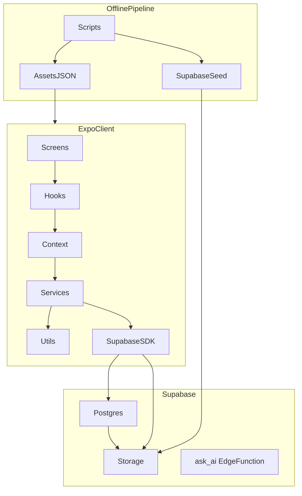
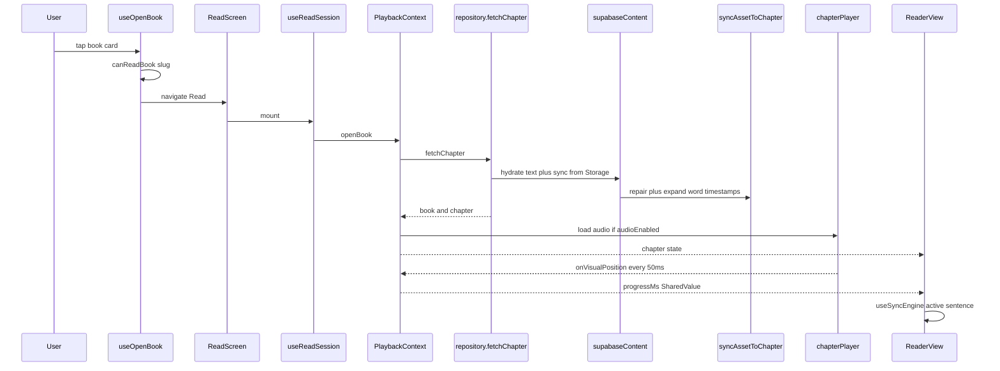

# Readr — Architecture Source of Truth

Engineering reference for the Readr codebase. Describes what exists, how data moves, and where the brittle parts are. For setup commands see [README.md](README.md).

---

## 1. System Overview & Tech Stack

### Core purpose

Readr is a **bimodal reading application**: chapter text displayed in a virtualized reader, optionally synchronized with spoken audio (LibriVox) at **word-level granularity** (karaoke-style highlight). Additional capabilities:

- Cloud bookmarks (sentence-scoped highlights, offline-first)
- Kindle-style text selection with drag handles
- Dictionary lookup (Free Dictionary API) + translate
- Sentence-context Ask AI (OpenAI via Supabase Edge Function)
- Open Library–sourced discovery catalog; **readable text/audio/sync served exclusively from Supabase**

**Production MVP target:** *The Great Gatsby* chapter 1 with real WhisperX word alignment (~5,888 words, 152 sentences). Other chapters are not yet aligned; the runtime is fully data-driven so any Supabase-seeded chapter plays without code changes.

> Note: runtime mock/seed content was removed — Supabase is the single source of truth. `src/mocks/mockBook.json` survives only as offline tooling input for the seed + alignment scripts; no `src/` runtime module imports it.

### Languages and runtimes

| Layer | Technology |
|-------|------------|
| Mobile client | TypeScript, React 19.0.0, React Native 0.79.6, Expo SDK ~53.0.0 |
| Offline tooling | TypeScript via `tsx`, Python 3 (WhisperX alignment — not bundled in app) |
| Backend | PostgreSQL, Supabase Auth, Supabase Storage, Deno Edge Functions |
| CI | Node 20, GitHub Actions |

### Critical third-party dependencies

From [package.json](package.json):

| Category | Package | Version (approx.) |
|----------|---------|-------------------|
| Navigation | `@react-navigation/native`, `native-stack`, `bottom-tabs` | ^7.x |
| Backend SDK | `@supabase/supabase-js` | ^2.106.2 |
| State | `zustand` | ^5.0.14 |
| Audio | `expo-av` | ~15.1.7 |
| Animation | `react-native-reanimated` | ~3.17.4 |
| Persistence | `@react-native-async-storage/async-storage`, `expo-file-system`, `expo-secure-store` | Expo 53–aligned |
| Auth helpers | `expo-auth-session`, `expo-linking`, `expo-web-browser` | Expo 53–aligned |
| Testing | `vitest` | ^4.1.8 |

**Explicitly not used:** Expo Router, Redux, TanStack Query, MobX, a custom REST API server in-repo.

### External APIs and services

| Service | Role | Where configured |
|---------|------|------------------|
| Supabase | Auth (email OTP), Postgres, Storage, Edge Functions | [src/config/env.ts](src/config/env.ts), [src/services/supabase/client.ts](src/services/supabase/client.ts) |
| Open Library REST | Catalog metadata (title, author, cover, description) | [src/services/openLibrary/openLibraryService.ts](src/services/openLibrary/openLibraryService.ts) |
| OpenAI | Ask AI completions (`gpt-4.1-mini`) | [supabase/functions/ask-ai/index.ts](supabase/functions/ask-ai/index.ts) |
| WhisperX | Offline forced alignment (Colab/local GPU) | [scripts/alignment/whisperx/align_chapter.py](scripts/alignment/whisperx/align_chapter.py) |

### Application bootstrap

```
expo/AppEntry.js  →  App.tsx  →  providers  →  AppShell  →  NavigationContainer
```

There is **no** root `index.tsx`. Expo's entry loads [App.tsx](App.tsx), which mounts (outermost → innermost):

```tsx
SafeAreaProvider
  → AuthProvider              // session, OTP, dev guest
    → ProgressProvider        // Reanimated SharedValue for 60fps karaoke clock
      → CatalogProvider       // book catalog + discovery list
        → BookmarkProvider    // bookmark CRUD, offline-first sync
          → PlaybackProvider  // chapter, audio, session orchestration
            → AiProvider      // Ask AI sheet state
              → AppShell      // Auth gate → RootNavigator | AuthScreen
```

State was decomposed out of the former `PlaybackContext` god-context into [CatalogContext](src/context/CatalogContext.tsx), [BookmarkContext](src/context/BookmarkContext.tsx), and [AiContext](src/context/AiContext.tsx).

---

## 2. Project Architecture & Directory Structure

### Architectural pattern

**Layered monolith client** + **Supabase BaaS** + **offline content pipeline**.

This is not MVC, Clean Architecture, or microservices. The closest label: **feature-oriented layers** with:

- A **facade repository** ([src/services/content/repository.ts](src/services/content/repository.ts)) for all book/chapter I/O
- **Domain contexts** — playback session ([PlaybackContext.tsx](src/context/PlaybackContext.tsx)), catalog ([CatalogContext.tsx](src/context/CatalogContext.tsx)), bookmarks ([BookmarkContext.tsx](src/context/BookmarkContext.tsx)), Ask AI ([AiContext.tsx](src/context/AiContext.tsx))
- **Pure utils** for sync math and chapter transformation



### Directory map

| Path | Responsibility |
|------|----------------|
| [App.tsx](App.tsx) | Root provider tree and auth shell |
| [src/screens/](src/screens/) | Route-level screens (Home, Explore, Library, Community, Read, ReadUnavailable, Auth, Profile) |
| [src/navigation/](src/navigation/) | React Navigation v7: root stack + five-tab main navigator |
| [src/components/](src/components/) | Reusable UI; [ReaderView.tsx](src/components/ReaderView.tsx) and [KaraokeWord.tsx](src/components/KaraokeWord.tsx) are sync-critical |
| [src/components/read/](src/components/read/) | Read-mode UI: selection (`SelectionToolbar`, `SelectionHandle`), `DefinitionCard`, `ParagraphRow`, `ReadModeBar`, `ReturnToSyncBtn`, transport, listen view |
| [src/context/](src/context/) | [AuthContext](src/context/AuthContext.tsx), [PlaybackContext](src/context/PlaybackContext.tsx) (~551 lines), [CatalogContext](src/context/CatalogContext.tsx), [BookmarkContext](src/context/BookmarkContext.tsx), [AiContext](src/context/AiContext.tsx) |
| [src/store/](src/store/) | Zustand stores ([useContentStore](src/store/useContentStore.ts), [usePlaybackStore](src/store/usePlaybackStore.ts)) + [ProgressProvider.tsx](src/store/ProgressProvider.tsx) |
| [src/services/](src/services/) | I/O boundaries: content, auth, audio, bookmarks, AI, dictionary, Supabase client |
| [src/hooks/](src/hooks/) | Composition: `useOpenBook`, `useReadSession`, `useSyncEngine`, `useCoarseSyncTime`, `useTextSelection`, `useLongPress` |
| [src/utils/](src/utils/) | Pure logic: sync engine/asset, timeline repair, chapter builder, karaoke math, `paragraphSentences`, `sentenceSync`, `sha256` |
| [src/types/](src/types/) | Shared TypeScript contracts |
| [src/data/](src/data/) | Static + runtime config: theme, book covers, [bundledSyncAssets.ts](src/data/bundledSyncAssets.ts) (offline fallback), [emptyChapter.ts](src/data/emptyChapter.ts) (neutral initial state) |
| [src/mocks/mockBook.json](src/mocks/mockBook.json) | Gatsby text; **offline tooling only** — input for seed + align extract, never imported by `src/` runtime |
| [assets/sync/](assets/sync/) | Committed WhisperX output (Gatsby ch.1: ~535 KB JSON, ~5,888 words) |
| [assets/align/](assets/align/) | Alignment pipeline sentence input |
| [assets/audio/](assets/audio/) | LibriVox MP3 (gitignored); demo MP3 may be bundled |
| [scripts/](scripts/) | Ingest, alignment, validation, Supabase seed — **never imported by the app** |
| [supabase/migrations/](supabase/migrations/) | Postgres schema, RLS, storage buckets |
| [supabase/functions/](supabase/functions/) | Deno edge functions |
| [.github/workflows/ci.yml](.github/workflows/ci.yml) | CI: typecheck, lint, test |

### Navigation structure

**Root stack** ([src/navigation/RootNavigator.tsx](src/navigation/RootNavigator.tsx)):

- `MainTabs` — bottom tab navigator
- `Read` — full-screen modal (`bookSlug`, optional `chapterSlug`)
- `ReadUnavailable` — book not yet seeded/readable

**Bottom tabs** ([src/navigation/MainTabs.tsx](src/navigation/MainTabs.tsx)): Home, Explore, Library, Community, Profile.

Route param types: [src/navigation/types.ts](src/navigation/types.ts).

---

## 3. Core Data Flow & State Management

### Primary lifecycle: open book → read with karaoke

There are **two different functions named `openBook`** — a common source of confusion:

| Function | File | Does |
|----------|------|------|
| Navigation gate | [src/hooks/useOpenBook.ts](src/hooks/useOpenBook.ts) | Checks `canReadBook`, navigates to `Read` or `ReadUnavailable` |
| Content load | [src/context/PlaybackContext.tsx](src/context/PlaybackContext.tsx) `openBook` | Fetches chapter, hydrates sync, loads audio, updates session state |



### Content source routing

Controlled by [src/store/useContentStore.ts](src/store/useContentStore.ts) — persisted to AsyncStorage under `readr.content.sources`:

| Setting | Default | Effect |
|---------|---------|--------|
| `audioEnabled` | `true` | Whether the audio player loads (sync/karaoke timings load regardless) |
| `readableBookSlugs` | from Supabase | Which catalog slugs have seeded readable text |

There is **no longer** a `textSource`/`catalogSource` toggle — Supabase is the sole runtime content source.

**Facade:** [src/services/content/repository.ts](src/services/content/repository.ts):

| Function | Source | Notes |
|----------|--------|-------|
| `fetchChapter` | [supabaseContent.ts](src/services/content/supabaseContent.ts) | Storage text JSON + WhisperX sync overlay; throws `ChapterNotFoundError` if missing |
| `fetchCatalog` / `fetchBooks` | Open Library (discovery) + Supabase (readable) | Supabase books win on slug collision; OL books are browse-only with empty chapters |
| `canReadBook` / `refreshReadableBookSlugs` | Supabase `books` | Drives readable badge + Read vs ReadUnavailable |

In-memory chapter cache keyed by `bookSlug:chapterSlug`.

### Supabase chapter hydration

[src/services/content/supabaseContent.ts](src/services/content/supabaseContent.ts) `hydrateChapterFromSupabase`:

1. **Text (required):** Download `text/{book}/ch-{n}.json` from Storage → [textCache.ts](src/services/sync/textCache.ts) → [textAssetToChapter](src/utils/textAsset.ts) (synthetic placeholder word times). On fetch failure, falls back to cached file then a slug-keyed bundled asset ([bundledSyncAssets.ts](src/data/bundledSyncAssets.ts)).
2. **Sync (when `sync_hash` present):** Download `sync/{book}/ch-{n}.json` → [cache.ts](src/services/sync/cache.ts) → [syncAssetToChapter](src/utils/syncAsset.ts) (replaces word timings with WhisperX data). This is **independent of `audioEnabled`** so karaoke timings are present even when audio playback is off.
3. **Offset:** taken directly from the `chapters.audio_offset_ms` DB column (the former client-side override map was removed).

Open Library ([openLibraryService.ts](src/services/openLibrary/openLibraryService.ts)) supplies discovery metadata only. It does **not** provide chapter text or chapter lists. Books without seeded text show [ReadUnavailableScreen](src/screens/ReadUnavailableScreen.tsx).

### Sync asset pipeline (runtime)

Every call to `syncAssetToChapter` in [src/utils/syncAsset.ts](src/utils/syncAsset.ts):

1. Runs [repairSyncAsset](src/utils/syncTimelineRepair.ts) (timeline gap + monotonic timing fixes)
2. Detects legacy file-audio coordinates via `usesLegacyAudioWordTimings()`
3. Expands minified JSON `{ w, s, e }` into runtime `Chapter` with `Sentence[]` and `WordTimestamp[]`
4. Sets `audioOffsetMs`, `durationMs`, `syncHash`

**WhisperX failure mode:** Sentence 0 aligned to LibriVox disclaimer (~0–5 s visual) while sentence 1+ remain in file-audio coordinates (~27 s+). `repairTimelineGap` re-anchors sentence 1+ to visual time and sets `audio_offset_ms` to ~22 s (anchor minus 250 ms pre-roll). Same repair runs at build time (`npm run repair:sync`) and at runtime.

Current Gatsby ch.1 committed sync: `audio_offset_ms: 22287` in [assets/sync/the-great-gatsby/ch-1.json](assets/sync/the-great-gatsby/ch-1.json).

### Audio coordinate systems

| Timeline | Meaning | Used by |
|----------|---------|---------|
| **Visual** | Word `start_ms` / `end_ms` in chapter state; 0 = narration start | Karaoke, seek, progress bar |
| **File** | Raw MP3 position in milliseconds | Expo AV `positionMillis` |
| **`audio_offset_ms`** | File seek point before first spoken word (includes 250 ms pre-roll) | Player load/play |

Conversion in [src/utils/syncAsset.ts](src/utils/syncAsset.ts):

```typescript
audioToVisualMs(audioMs, offset)  // visual = max(0, audioMs - offset)
visualToAudioMs(visualMs, offset) // audio = visualMs + offset
```

[src/services/audio/chapterPlayer.ts](src/services/audio/chapterPlayer.ts):

- On `load`: file stays at 0; reports visual position 0
- On first `play()`: seeks to `audio_offset_ms` if position is before offset (skips LibriVox intro)
- Progress callbacks every 50 ms → `onVisualPosition` → updates Reanimated `progressMs`

### State management layers

Do not conflate these — they exist to separate re-render frequency from UI-thread animation:

| Layer | Mechanism | Holds | Update rate |
|-------|-----------|-------|-------------|
| [useContentStore](src/store/useContentStore.ts) | Zustand | `audioEnabled`, readable book slugs | Rare |
| [usePlaybackStore](src/store/usePlaybackStore.ts) | Zustand | `isPlaying`, `isImmersive`, `activeSentenceIndex`, loading flags, scroll targets, playback rate | User actions |
| [ProgressProvider](src/store/ProgressProvider.tsx) | Reanimated `SharedValue` | `progressMs` | ~50 ms from audio; read on UI thread by KaraokeWord |
| [PlaybackContext](src/context/PlaybackContext.tsx) | React Context | `book`, `chapter`, `wordIndex`, transport actions | On chapter/load actions |
| [CatalogContext](src/context/CatalogContext.tsx) | React Context | `books`, `catalog`, `isLoadingContent` | On catalog refresh |
| [BookmarkContext](src/context/BookmarkContext.tsx) | React Context | `bookmarks` + CRUD | On bookmark actions |
| [AiContext](src/context/AiContext.tsx) | React Context | Ask AI sheet state | On AI open/submit |

**Coarse React clock:** [useCoarseSyncTime](src/hooks/useCoarseSyncTime.ts) reads `progressMs` on a ~50 ms interval for sentence-level React consumers (e.g. [useSyncEngine](src/hooks/useSyncEngine.ts)). Karaoke word fill uses the `progressMs` SharedValue directly — not React state. There is no separate `SyncTimeContext`. `usePlayback()` is an alias of `usePlaybackSession()`.

**Sync lookup:** [buildWordIndex](src/utils/syncAsset.ts) flattens all words on chapter change. [findActiveWord](src/utils/syncEngine.ts) binary-searches the flat index — O(log n), adequate for ~10k words.

### Startup (before any book open)

On mount:

1. [CatalogProvider](src/context/CatalogContext.tsx) waits for `useContentStore.hydrate()`, then `refreshCatalog()` → `reloadCatalog()` → refresh readable slugs + fetch catalog + fetch books
2. [BookmarkProvider](src/context/BookmarkContext.tsx) loads bookmarks (local cache, then Supabase sync if authenticated)
3. [PlaybackProvider](src/context/PlaybackContext.tsx) starts with a neutral [EMPTY_CHAPTER](src/data/emptyChapter.ts) until a book is opened

---

## 4. Critical Connections & Dependencies

### Hotspots

Files with highest fan-in or complexity — change these with care:

| File | Why it is hot |
|------|---------------|
| [src/context/PlaybackContext.tsx](src/context/PlaybackContext.tsx) | Chapter load, audio, transport, sync clock, `jumpToBookmark`; large memoized session value |
| [src/services/content/repository.ts](src/services/content/repository.ts) | All content paths converge here |
| [src/services/content/supabaseContent.ts](src/services/content/supabaseContent.ts) | Text + sync + audio hydration from Storage/DB |
| [src/utils/syncAsset.ts](src/utils/syncAsset.ts) + [syncTimelineRepair.ts](src/utils/syncTimelineRepair.ts) | Sync JSON ↔ runtime chapter; intro gap repair |
| [src/components/ReaderView.tsx](src/components/ReaderView.tsx) | FlashList chapter render; karaoke scoped to active sentence; selection/handles geometry |

### Internal module boundaries

These are not HTTP APIs — they are TypeScript module contracts:

| Export | Defined in | Consumers | Contract |
|--------|------------|-----------|----------|
| `fetchChapter(bookSlug, chapterSlug)` | [repository.ts](src/services/content/repository.ts) | PlaybackContext | `{ book, chapter }` with populated `chapter.sentences[].words[]` |
| `syncAssetToChapter(asset, meta)` | [syncAsset.ts](src/utils/syncAsset.ts) | supabaseContent | `Chapter` with visual word times |
| `buildWordIndex(chapter)` | [syncAsset.ts](src/utils/syncAsset.ts) | PlaybackContext | Flat sorted `IndexedWord[]` |
| `findActiveWord(index, timeMs)` | [syncEngine.ts](src/utils/syncEngine.ts) | [useSyncEngine.ts](src/hooks/useSyncEngine.ts) | Active sentence/word from coarse clock |
| `chapterAudioPlayer.load/play/seekVisualMs` | [chapterPlayer.ts](src/services/audio/chapterPlayer.ts) | PlaybackContext | Callback-driven visual position |
| `loadChapterSyncAsset` / `loadChapterTextAsset` | [cache.ts](src/services/sync/cache.ts), [textCache.ts](src/services/sync/textCache.ts) | Content services | Hash-versioned filesystem cache |
| `apiRequest('/v1/ask-ai')` | [api/client.ts](src/services/api/client.ts) | [askAi.ts](src/services/ai/askAi.ts) | Proxies to Supabase edge function URL |

**No in-repo REST server.** [EXPO_PUBLIC_API_BASE_URL](src/config/env.ts) routes Ask AI to the edge function when set; all other backend I/O uses `@supabase/supabase-js` directly.

### Offline alignment pipeline (build-time only)

```
mockBook.json
  → npm run align:extract     → assets/align/.../sentences.json
  → WhisperX align_chapter.py → assets/sync/.../ch-1.json
  → npm run repair:sync       → gap + monotonic fix on disk
  → npm run validate:sync     → schema + text parity gate
  → npm run seed:supabase     → Storage upload + DB upsert
```

See [scripts/alignment/whisperx/COLAB.md](scripts/alignment/whisperx/COLAB.md) for GPU alignment steps.

Chapter media registry: [scripts/alignment/chapterMediaManifest.ts](scripts/alignment/chapterMediaManifest.ts) (currently Gatsby ch.1).

---

## 5. Authentication, Authorization & Security

### Client-side auth gate

There is **no server middleware** in this repo. The Expo app gates access in [App.tsx](App.tsx):

```
AuthProvider hydrates session
  → if !isHydrated: spinner
  → if !isSignedIn: AuthScreen
  → else: RootNavigator
```

### Auth implementation files

| File | Role |
|------|------|
| [src/context/AuthContext.tsx](src/context/AuthContext.tsx) | Session state, OTP flow, dev guest, deep-link handler |
| [src/services/auth/session.ts](src/services/auth/session.ts) | `signInWithOtp`, `verifyOtp`, `signOut`, dev guest user |
| [src/services/auth/authCallback.ts](src/services/auth/authCallback.ts) | Magic-link token exchange via `setSession` |
| [src/services/auth/redirect.ts](src/services/auth/redirect.ts) | `readr://auth/callback` redirect URI |
| [src/services/supabase/client.ts](src/services/supabase/client.ts) | Singleton Supabase client; AsyncStorage session; `detectSessionInUrl: false` |
| [src/config/env.ts](src/config/env.ts) | `canUseDevGuestBypass()` = `!hasSupabaseConfig() \|\| __DEV__` |

**Auth method:** Email OTP (magic link support exists but primary flow is OTP per [AuthScreen](src/screens/AuthScreen.tsx)).

**Dev guest:** Synthetic user ID `dev-local-user`. Bookmarks are local-only; no Supabase writes when guest ([bookmarks/repository.ts](src/services/bookmarks/repository.ts) checks `isDevGuestUserId`).

Setup documentation: [supabase/AUTH_SETUP.md](supabase/AUTH_SETUP.md).

### Server-side authorization (RLS)

Primary schema: [supabase/migrations/001_init_v2.sql](supabase/migrations/001_init_v2.sql).

| Table / resource | Policy |
|------------------|--------|
| `books`, `chapters`, `sentences` | Public SELECT |
| `user_highlights` | CRUD scoped to `auth.uid()` |
| `ai_threads`, `ai_messages` | CRUD scoped to `auth.uid()` |
| Storage buckets (`003_storage.sql`, `004_text_storage.sql`) | Public read on `audio`, `sync`, `text`, `covers` |

Text metadata columns added in [004_text_storage.sql](supabase/migrations/004_text_storage.sql): `text_metadata_path`, `text_hash`, `text_version` on `chapters`.

### Known security gaps

Document these when extending the system:

1. **Ask AI edge function** ([supabase/functions/ask-ai/index.ts](supabase/functions/ask-ai/index.ts)): Now validates the bearer JWT via `verifyJwt()` (`supabase.auth.getUser`) and rejects unauthenticated requests (401). CORS remains `Access-Control-Allow-Origin: *`. Residual risk: the client-side `EXPO_PUBLIC_ASK_AI_FALLBACK` stub can mask backend/auth failures (see §6.10).
2. **Public storage buckets:** Anyone with the URL can fetch audio, sync, and text JSON assets.
3. **Dev guest in `__DEV__`:** Bypasses real auth even when Supabase is configured ([env.ts](src/config/env.ts)).
4. **Migration drift:** [002_content_alignment.sql](supabase/migrations/002_content_alignment.sql) references legacy `bookmarks` RLS; the app uses `user_highlights`.
5. **Service role key:** Only used in [scripts/seed/supabaseSeed.ts](scripts/seed/supabaseSeed.ts) and check scripts — must never ship in the app bundle.

---

## 6. The "Hidden Truth" (Tech Debt & Gotchas)

### Architectural debt

1. **Split-source confusion.** Open Library provides discovery catalog metadata only. Readable text/audio/sync require a Supabase seed. Open Library books without a matching seeded slug navigate to `ReadUnavailable`.

2. **Two `openBook` functions.** [useOpenBook](src/hooks/useOpenBook.ts) navigates; [PlaybackContext.openBook](src/context/PlaybackContext.tsx) loads content. Debugging "book won't open" vs "chapter won't load" requires knowing which one is failing.

3. **Relational `sentences` table vs runtime.** The app reads **Storage JSON** at runtime, not Postgres `sentences` rows. DB sentences are populated at seed time for FK/RLS integrity and potential future server use.

4. **WhisperX intro mis-map.** Sentence 0 frequently aligns to the LibriVox spoken disclaimer instead of chapter narration. Requires [repairTimelineGap](src/utils/syncTimelineRepair.ts) and `audio_offset_ms` ~22 s for Gatsby (not the raw WhisperX value of ~341 ms). Repair runs on every `syncAssetToChapter` call and via `npm run repair:sync`.

5. **Karaoke performance ceiling.** Gatsby ch.1 has ~5,888 words across 152 sentences. Mounting a [KaraokeWord](src/components/KaraokeWord.tsx) (dual `Text` layers + Reanimated `useAnimatedStyle`) per word **crashes the app**. Current mitigations in [ReaderView.tsx](src/components/ReaderView.tsx):
   - Word karaoke renders **only on the active sentence** via `shouldShowWordKaraoke()` ([readerViewUtils.ts](src/utils/readerViewUtils.ts)); a `getItemType` of `'karaoke'` vs static prevents FlashList cell reuse across the two row shapes.
   - `isImmersive` is set on play/word-tap, not on audio load.

6. **List virtualization is in place.** [ReaderView](src/components/ReaderView.tsx) now uses `@shopify/flash-list` (`overrideItemLayout`, measured row-height cache, viewability pairs). Heed §8 rules when touching it. (Earlier `ScrollView` debt resolved.)

7. **Sync cache hash.** [sha256.ts](src/utils/sha256.ts) provides SHA-256; `hashSyncAsset` ([syncAsset.ts](src/utils/syncAsset.ts)) uses it for cache invalidation.

8. **Legacy coordinate heuristic.** `usesLegacyAudioWordTimings()` / `resolveTimelineCoords()` infer coordinate system from `audio_offset_ms` vs first word. Brittle if WhisperX output shape changes; `normalizeSyncAssetForRuntime()` auto-repairs timeline gaps at load.

9. **CI gap.** [.github/workflows/ci.yml](.github/workflows/ci.yml) runs `typecheck`, `lint`, `test` only. [package.json](package.json) `ci` script also runs `validate:mock-book` and `validate:sync` — those gates are **not** in GitHub Actions.

10. **Ask AI silent fallback.** If the edge function fails and `EXPO_PUBLIC_ASK_AI_FALLBACK` is not `false`, [askAi.ts](src/services/ai/askAi.ts) returns a hardcoded stub answer without surfacing the error.

11. **No TODO/FIXME in application source.** Technical debt is structural, not annotated in code.

12. **Python alignment outside npm test.** WhisperX output is validated manually via Colab + `npm run validate:sync`. No automated GPU CI.

### Anti-patterns in current code

| Issue | Location | Impact |
|-------|----------|--------|
| Large session memo | PlaybackContext | ~30-field memoized value; session changes can re-render many consumers (catalog/bookmark/AI now split out to reduce this) |
| ~20 Hz React sync clock | `useCoarseSyncTime` interval | Sentence highlighting re-renders despite karaoke using SharedValue |
| Deep clone in repair | `JSON.parse(JSON.stringify(asset))` in syncTimelineRepair | Allocates full sync asset on every chapter load |
| Optimistic sign-out | session.ts + AuthContext | Local state cleared before async Supabase signOut completes |
| No persistent in-text highlights | ReaderView / ParagraphRow | Saved bookmarks are not re-rendered as highlights; selection styling is transient only |

### Scaling bottlenecks

| Resource | Current scale (Gatsby ch.1) | Limit |
|----------|----------------------------|-------|
| Words in chapter | ~5,888 | Active-sentence karaoke ~240 words max; full-chapter karaoke OOM/crash |
| Sync JSON size | ~535 KB / ~30k lines | Parsed entirely into memory; duplicated on repair clone |
| Sentences in FlashList | 152 | Windowed; variable row heights measured + cached |
| wordIndex array | 5,888 entries | Rebuilt on every chapter object change |
| Storage cache | Per-chapter filesystem JSON | No LRU eviction; grows with chapters opened |

---

## 7. Entry Points & Onboarding

### Local development quickstart

```bash
cp .env.example .env          # optional: EXPO_PUBLIC_SUPABASE_URL, EXPO_PUBLIC_SUPABASE_ANON_KEY
npm install
npm run start
```

Audio is enabled by default; Profile screen has a dev toggle to turn it off. Karaoke timings load from Supabase regardless of the audio toggle.

Full aligned chapter pipeline:

```bash
npm run fetch:gatsby-audio     # LibriVox MP3 → assets/audio/ (gitignored)
npm run align:extract          # mockBook.json → assets/align/.../sentences.json
# GPU: run align_chapter.py per scripts/alignment/whisperx/COLAB.md
npm run repair:sync
npm run validate:sync
npm run seed:supabase          # requires SUPABASE_SERVICE_ROLE_KEY
npx expo start -c
```

Verification:

```bash
npm run typecheck && npm run lint && npm run test
npm run ci                     # adds validate:mock-book + validate:sync
npm run supabase:check         # DB + storage sanity
```

### "I need to change X — start here"

| Goal | Start here |
|------|------------|
| Book catalog / Explore list | [openLibraryService.ts](src/services/openLibrary/openLibraryService.ts), [ExploreScreen.tsx](src/screens/ExploreScreen.tsx) |
| Which books are readable | [repository.ts](src/services/content/repository.ts) `canReadBook` / `refreshReadableBookSlugs`, [useContentStore.ts](src/store/useContentStore.ts) |
| Chapter text loading | [supabaseContent.ts](src/services/content/supabaseContent.ts), [textCache.ts](src/services/sync/textCache.ts) |
| Karaoke / word highlight | [ReaderView.tsx](src/components/ReaderView.tsx), [KaraokeWord.tsx](src/components/KaraokeWord.tsx), [karaoke.ts](src/utils/karaoke.ts), [readerViewUtils.ts](src/utils/readerViewUtils.ts) |
| Text selection / dictionary | [useTextSelection.ts](src/hooks/useTextSelection.ts), [SelectionToolbar.tsx](src/components/read/SelectionToolbar.tsx), [DefinitionCard.tsx](src/components/read/DefinitionCard.tsx), [dictionaryService.ts](src/services/dictionary/dictionaryService.ts) |
| Audio sync / seek / intro skip | [chapterPlayer.ts](src/services/audio/chapterPlayer.ts), [PlaybackContext.tsx](src/context/PlaybackContext.tsx) |
| Sync JSON format / repair | [syncAsset.ts](src/utils/syncAsset.ts), [syncTimelineRepair.ts](src/utils/syncTimelineRepair.ts), [scripts/alignment/](scripts/alignment/) |
| New WhisperX-aligned chapter | [COLAB.md](scripts/alignment/whisperx/COLAB.md) → `repair:sync` → `validate:sync` → [supabaseSeed.ts](scripts/seed/supabaseSeed.ts) |
| Seed Supabase | [scripts/seed/supabaseSeed.ts](scripts/seed/supabaseSeed.ts) |
| Auth / login | [AuthContext.tsx](src/context/AuthContext.tsx), [AuthScreen.tsx](src/screens/AuthScreen.tsx), [AUTH_SETUP.md](supabase/AUTH_SETUP.md) |
| Bookmarks | [bookmarks/repository.ts](src/services/bookmarks/repository.ts), [BookmarksPanel.tsx](src/components/BookmarksPanel.tsx) |
| Ask AI | [PlaybackContext.tsx](src/context/PlaybackContext.tsx) `submitAskAi`, [askAi.ts](src/services/ai/askAi.ts), [ask-ai/index.ts](supabase/functions/ask-ai/index.ts) |
| Navigation / new screen | [RootNavigator.tsx](src/navigation/RootNavigator.tsx), [types.ts](src/navigation/types.ts) |
| Env / backend config | [.env.example](.env.example), [env.ts](src/config/env.ts) |
| Audio offset tuning | `chapters.audio_offset_ms` DB column (re-seed) or `repair:sync` on the committed asset |
| Database schema | [supabase/migrations/001_init_v2.sql](supabase/migrations/001_init_v2.sql) |
| Ingest Gatsby EPUB/text | [scripts/ingest/runGatsby.ts](scripts/ingest/runGatsby.ts), [standardEbooks.ts](scripts/ingest/standardEbooks.ts) |

### Test coverage map

Vitest config: [vitest.config.ts](vitest.config.ts) — Node environment, [src/tests/](src/tests/) only.

| Test file | Covers |
|-----------|--------|
| syncEngine.test.ts | `findActiveWord` binary search |
| syncAsset.test.ts | Legacy vs visual timing normalization |
| syncAssetReady.test.ts | `syncReady` / runtime normalization |
| syncTimelineRepair.test.ts | WhisperX gap repair + intro offset |
| validateSyncAsset.test.ts | Validation rule helpers |
| sentenceSync.test.ts | Active-sentence resolution |
| paragraphSentences.test.ts | Grammatical sentence span splitting |
| readerViewUtils.test.ts | `shouldShowWordKaraoke` gating |
| karaoke.test.ts | Word fill / active-word math |
| bundledFallback.test.ts | Offline slug-keyed bundled fallback |
| emailOtp.test.ts | OTP input validation |
| bookmarkFlow.test.ts | Bookmark grouping utils |

**Not covered:** AuthContext, PlaybackContext, CatalogContext, BookmarkContext, AiContext, ReaderView, KaraokeWord, useTextSelection, chapterPlayer, dictionary/Supabase I/O, component/E2E tests.

### Related documentation

| Document | Contents |
|----------|----------|
| [README.md](README.md) | Setup, env vars, high-level file index |
| [supabase/AUTH_SETUP.md](supabase/AUTH_SETUP.md) | OTP templates, SMTP, redirect URLs |
| [scripts/alignment/whisperx/COLAB.md](scripts/alignment/whisperx/COLAB.md) | GPU alignment operator workflow |
| [scripts/alignment/whisperx/README.md](scripts/alignment/whisperx/README.md) | Alignment script parameters |
| [assets/audio/README.md](assets/audio/README.md) | Local audio placement, LibriVox intro note |
| [.cursor/plans/whisperx_offset_pipeline_41a7bedb.plan.md](.cursor/plans/whisperx_offset_pipeline_41a7bedb.plan.md) | Original offset pipeline design (historical) |

---

*Last aligned with codebase state including: Supabase-only content (mock/seed runtime removed), context decomposition (Catalog/Bookmark/Ai split from Playback), FlashList virtualized reader, text selection + dictionary, Ask AI JWT validation, and Gatsby ch.1 sync repair (`audio_offset_ms: 22287`).*

---

## 8. Important Rules for AI Agents
1. **Never Break the Virtualization**: Do not alter `FlashList` properties in `ReaderView.tsx` that would force a full re-render of the text list.
2. **Absolute Y-Coordinates**: When calculating layout coordinates in `ReaderView.tsx` (e.g. for drag handles or autoscroll), always remember to include the paragraph margin (`theme.spacing.lg`) in the height accumulator loops. The `ParagraphRow` layout height does *not* include this margin!
3. **Context Boundaries**: State has been cleanly separated (Playback, AI, Bookmark, Catalog). If a new feature doesn't strictly need audio playback state, do NOT put it in `PlaybackContext`. Use the appropriate domain context or create a new one.
