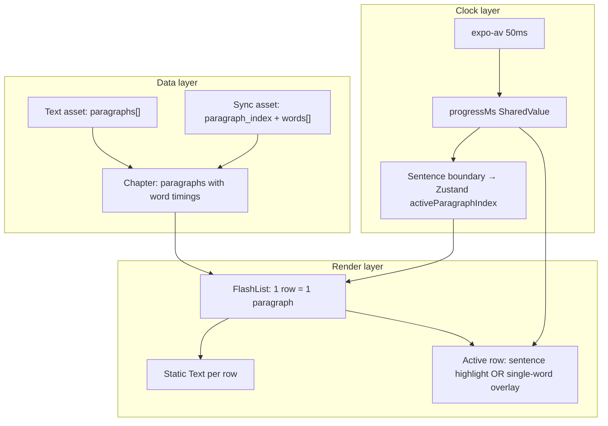

# Read View — Design Review & Recommendations

Engineering review of Read mode architecture, inefficiencies, and proposed changes. Written from the perspective of a bimodal reader/audiobook user, grounded in the current codebase (Gatsby ch.1 as the production target: ~5,888 words, 152 sync blocks).

For implementation details of what exists today, see [ARCHITECTURE.md](../ARCHITECTURE.md).

---

## 1. The reader's mental model vs. what we built

A bimodal reader expects:

1. **Paragraphs** they can read comfortably (typographic units)
2. **Audio that follows** what they're looking at
3. **Tap to jump** to a place in the book without fighting the UI
4. **Smooth follow-along** without jank, freezes, or desync

What we ship today conflates three different units:

| Concept | User thinks | Code uses |
|---------|-------------|-----------|
| Paragraph | One block of text with a line break | Sometimes 1 sentence, sometimes 200+ words |
| Sentence | A grammatical sentence | WhisperX alignment block (`chapter.sentences[]`) |
| Word | Smallest highlight unit | `WordTimestamp` + optional `KaraokeWord` |

For Gatsby ch.1, `mockBook.json` has **152 paragraphs**, and sync also has **152 blocks** — but block `s-2` is an entire long paragraph (~200 words, ~88 seconds of audio). When a user says "3rd paragraph," they mean a reading block; the app treats it as one sync sentence and tries to karaoke inside it. That mismatch is the root of karaoke crashes and confusing behavior around specific words (e.g. "mind").

---

## 2. Design inefficiencies (ranked by impact)

### 2.1 Word-as-component rendering at chapter scale

**Current behavior**

When `isImmersive` is true (which happens on play), every sentence expands into individual `Pressable` + `Text` nodes — ~5,888 for Gatsby ch.1. Only the active word gets `KaraokeWord`, but the component tree is still enormous.

Location: `src/components/ReaderView.tsx` — immersive branch maps `sentence.words` to one `Pressable` per word across **all** sentences.

**Reader impact**

- Layout cost and memory pressure on long chapters
- Touch-target noise; hard to scroll without accidental taps
- Scroll jank when auto-follow triggers layout

**Industry pattern (Kindle, Apple Books, Speechify)**

Render **paragraph text as one or few native text nodes**. Drive highlight with spans, canvas, or a single overlay — not N React components per word.

**Recommended change**

- **Default highlight granularity: sentence/paragraph** (orange background on active block)
- **Word karaoke: active-window only** — decompose only the active ±1 paragraphs into word nodes
- Explore **Canvas / Skia / native Text with background spans** for word fill instead of dual-layer `Text` + Reanimated clip per word

---

### 2.2 No virtualization in a 40+ minute chapter

**Current behavior**

`ScrollView` mounts all 152 sentence rows. In immersive mode, that becomes ~5,888 word nodes.

**Reader impact**

- Slow chapter open
- Heavy memory use
- Layout thrashing when auto-scrolling

**Recommended change**

- **`FlashList` / virtualized list** with sentence-level rows (not word-level)
- Windowing: mount word-level detail only for visible + active rows
- Defer `onLayout` scroll tracking until row is near viewport

**Note:** FlashList v2 was attempted and reverted (requires New Architecture). FlashList v1 or a simpler visible-range renderer is still needed; karaoke should be sentence-first regardless.

---

### 2.3 Dual clocks causing unnecessary re-renders

**Current behavior**

Three time sources:

| Source | Rate | Used for |
|--------|------|----------|
| `progressMs` SharedValue | ~50 Hz | Karaoke fill (UI thread) |
| `useCoarseSyncTime(100)` | 10 Hz | **Every** `SentenceRow` recomputes `activeWordIndex` |
| `useCoarseSyncTime(250)` | 4 Hz | `useSyncEngine`, transport labels |

Even **inactive** sentences recalculate word index 10×/second because `syncTimeMs` is passed to all rows.

Locations:

- `src/components/ReaderView.tsx` — `useCoarseSyncTime(100)` at parent, passed to every `SentenceRow`
- `src/hooks/useSyncEngine.ts` — `useCoarseSyncTime(250)`
- `src/store/ProgressProvider.tsx` — `progressMs` SharedValue

**Recommended change**

- Pass sync time / word index **only to the active sentence row**
- Inactive rows: static `Text`, no clock subscription
- Single source of truth: `progressMs` on UI thread; React reads sentence index only on **boundary crossings** (partially done via `PlaybackContext.syncActiveSentenceIndex`)

---

### 2.4 Alignment unit ≠ reading unit (pipeline design)

**Current behavior**

WhisperX outputs arbitrary speech segments. One segment can swallow a full paragraph. Runtime repair (`repairTimelineGap`, gap handling in `findActiveSentenceIndex`) patches symptoms in the client.

Locations:

- `src/utils/syncTimelineRepair.ts`
- `src/utils/sentenceSync.ts`
- `assets/sync/the-great-gatsby/ch-1.json`

**Reader impact**

- Dead zones between segments
- Seek feels broken or snaps back
- Highlight jumps feel wrong
- Repair logic is fragile (e.g. inter-sentence gap collapse desyncs from audio)

**Recommended change (pipeline, not app)**

- **Canonical unit = paragraph** from `mockBook.json` / text asset
- Alignment pipeline **forces** one sync block per paragraph (split/join WhisperX output at paragraph boundaries)
- Store `{ paragraph_index, words[] }` — names should match UX
- Run all timeline repair **offline only** (`npm run repair:sync`); never mutate at runtime in `syncAssetToChapter`

This is the highest-leverage fix for sync trustworthiness.

---

### 2.5 Immersive mode flips the entire UI tree

**Current behavior**

Playing toggles `isImmersive`, which switches from 152 plain `Text` blocks to ~5,888 interactive word nodes — a full tree rewrite mid-session.

Location: `src/store/usePlaybackStore.ts` — `setPlaying` sets `isImmersive: true` when play starts.

**Reader impact**

- Hitch on play
- Layout shift
- Different tap behavior before vs. after play

**Recommended change**

- **Stable render tree** regardless of play state
- Visual changes only: opacity, highlight color, footer chrome
- Sentence-level tap-to-seek always available; word-level seek via double-tap or scrubber

---

### 2.6 Auto-scroll fights manual reading

**Current behavior**

Every active sentence change triggers animated scroll.

Location: `src/components/ReaderView.tsx` — `useEffect` on `activeSentenceIndex` calls `scrollToSentence`.

**Reader impact**

If the user scrolls ahead to preview or re-read, playback yanks them back — a common audiobook annoyance.

**Recommended change**

- **Follow mode toggle** (on by default): auto-scroll only when active sentence leaves viewport
- Detect user scroll → pause follow for N seconds (Audible / YouTube pattern)
- Sentence-level scroll target, not word-level

---

### 2.7 Read vs. Listen are separate screens, shared brain

**Current behavior**

`ReadScreen` swaps between `ReaderView` and `AudiobookListenView` — different chrome, same `PlaybackContext` god-object (~700 lines).

Locations:

- `src/screens/ReadScreen.tsx`
- `src/context/PlaybackContext.tsx`

**Reader impact**

- Mode switch loses reading context
- Bookmarks/seek can feel inconsistent
- Two UX surfaces to maintain

**Recommended change (medium term)**

- **Single continuous screen:** text always visible, transport always at bottom
- Listen mode = collapsed/minimal chrome, optional cover art overlay
- Split `PlaybackContext` into smaller contexts (transport, chapter content, bookmarks)

---

### 2.8 KaraokeWord design is expensive for marginal UX gain

**Current behavior**

Each active word = 2 `Text` layers + `Animated.View` clip + `onLayout` measurement + Reanimated worklet.

Location: `src/components/KaraokeWord.tsx`

**Reader impact**

Fluid per-word fill is delightful for **one sentence**; catastrophic at chapter scale. Most audiobook apps use **sentence highlight** or **word bold** without per-character fill animation.

**Recommended change**

- **MVP highlight:** active word = solid orange; past words = orange text (already partially implemented)
- **Premium fill:** one Skia canvas draw call for the active line, not N components
- Drop per-word `onLayout` — use font metrics or precomputed widths offline

---

### 2.9 Seek UX: word tap is too granular for default interaction

**Current behavior**

Tap any word → `seekToWord(word.start_ms)`.

Location: `src/components/ReaderView.tsx` → `PlaybackContext.seekToWord`

**Reader impact**

- Hard to tap precisely while scrolling
- Accidental seeks
- Doesn't match how people navigate audiobooks (chapter → paragraph → scrubber)

**Recommended change**

- **Primary seek:** tap sentence/paragraph → jump to sentence start
- **Secondary seek:** double-tap word or long-press → word-precise seek
- **Scrubber** remains primary for coarse navigation

---

### 2.10 Runtime sync repair adds risk on every load

**Current behavior**

`syncAssetToChapter` always runs `repairSyncAsset` (gap repair, offset migration, monotonic fixes) on every chapter open.

Location: `src/utils/syncAsset.ts`

**Reader impact**

- Non-deterministic client-side mutation
- Hard to debug "works in JSON but wrong in app"
- Inter-sentence gap collapse at runtime broke sync with audio (reverted)

**Recommended change**

- Repair is **build-time only**; committed JSON is canonical
- Runtime: validate + fail loudly, or trust `sync_version`
- Versioned assets with hash invalidation

---

## 3. Proposed target architecture (Read view)

### Rendering rules

1. One list item = one paragraph (always)
2. Only the active paragraph row subscribes to time
3. Word karaoke only inside active row, max ~1 animated node
4. Inactive rows: plain text, sentence-level opacity dimming

---

## 4. Prioritized roadmap

| Priority | Change | Effort | Fixes |
|----------|--------|--------|-------|
| **P0** | Paragraph-aligned sync pipeline | Medium (pipeline) | Wrong paragraph boundaries, seek dead zones, "3rd paragraph" confusion |
| **P0** | Sentence-first highlight; word detail only on active paragraph | Small | Crashes, jank, re-render storm |
| **P1** | Virtualized list (sentence/paragraph rows) | Medium | Memory, scroll perf on long chapters |
| **P1** | Stop passing sync clock to inactive rows | Small | 10 Hz × 152 row re-renders |
| **P1** | Smart follow-scroll with user override | Small | Scroll fighting |
| **P2** | Stable render tree (no immersive tree swap) | Medium | Play hitch, tap inconsistency |
| **P2** | Runtime repair → build-time only | Small | Sync trust, debuggability |
| **P2** | Tap sentence to seek; word seek secondary | Small | Accidental seeks |
| **P3** | Unified Read/Listen screen | Large | Mode-switch UX |
| **P3** | Skia/canvas word fill | Large | Premium karaoke without component explosion |
| **P3** | Split PlaybackContext | Large | Maintainability |

---

## 5. What to keep

These choices are sound and match good bimodal reader patterns:

| Choice | Why it works |
|--------|--------------|
| Visual vs. file timeline with `audio_offset_ms` | Correct model for LibriVox intros |
| `progressMs` SharedValue for UI-thread animation | Right pattern; currently over-applied |
| Sentence-scoped bookmarks + Ask AI | Matches how people think about "this passage" |
| Immersive dimming of non-active content | Good focus mechanic |
| Separate Listen mode for pure audio | Fine as a mode; less ideal as a separate screen |
| Static JSON sync assets | Right storage strategy at scale |

---

## 6. Implementation paths

### Path A — Quick wins (no pipeline change)

Focus on rendering and clock isolation. Estimated impact: large stability gain in days, not weeks.

1. Sentence-first highlight; word decomposition only on active row
2. Remove `syncTimeMs` from inactive `SentenceRow` components
3. Smart follow-scroll (viewport-aware, user override)
4. Stable render tree — no immersive/non-immersive tree swap
5. Sentence tap to seek; word seek as secondary gesture

**Key files:** `ReaderView.tsx`, `KaraokeWord.tsx`, `usePlaybackStore.ts`, `PlaybackContext.tsx`

### Path B — Correct foundation (pipeline first)

Fix data model, then rebuild Read view.

1. Align WhisperX output to paragraph boundaries in `align_chapter.py`
2. Rename sync schema fields to `paragraph_index` where appropriate
3. Offline-only repair; runtime trust committed JSON
4. Rebuild `ReaderView` on virtualized paragraph rows
5. Optional Skia word fill on active row only

**Key files:** `scripts/alignment/`, `assets/sync/`, `src/utils/syncAsset.ts`, `ReaderView.tsx`

---

## 7. Bottom line

The biggest design mistake is treating **the React component tree as the sync engine** — one component per word across the whole chapter. That fights React Native's strengths and creates the crashes, tap bugs, and performance cliffs we've been patching.

The fix is not more patches to `KaraokeWord` or gap repair. It is:

1. **Align data to paragraphs** (what readers see)
2. **Render paragraphs, not words** (what RN handles well)
3. **Animate one active region** (what Reanimated handles well)
4. **Repair sync offline** (what the pipeline handles well)

---

## 8. Related bugs (symptoms of above)

Recent user-reported issues map to these design choices:

| Symptom | Likely design cause |
|---------|---------------------|
| Karaoke stops mid-paragraph (e.g. at "mind") | Word-as-component overload + oversized WhisperX block |
| Can't skip past paragraph 3 | Word pressables missing on non-active content; seek granularity |
| Progress bar intermittent | Async duration + stale closures (partially fixed) |
| Sync gaps / wrong seek targets | Alignment unit ≠ reading unit; runtime repair |

---

*Document created for design review. Last updated: June 2026.*

## Implementation status

| Ticket | Status |
|--------|--------|
| READ-1 Sentence-first highlight | Done — [ParagraphRow.tsx](../src/components/read/ParagraphRow.tsx) |
| READ-2 Clock isolation | Done — sync clock only in `ActiveKaraokeParagraphRow` |
| READ-3 Stable render tree | Done — static `Text` rows; word map only on active+playing |
| READ-4 Sentence-first seek | Done — tap paragraph; double-tap word |
| READ-5 Smart follow-scroll | Done — viewport-aware + Follow toggle in footer |
| READ-6 Phase 1 QA | Done — unit tests + `npm run ci` |
| SYNC-1 validate:sync policy | Done — block stats + max-words warnings |
| SYNC-2 Offline-only repair | Done — [syncAsset.ts](../src/utils/syncAsset.ts) trust-only load |
| SYNC-3 repair:sync Gatsby | Run `npm run repair:sync` after pull |
| READ-7 FlashList | Done — [ReaderView.tsx](../src/components/ReaderView.tsx) |
| READ-8 CI validate:sync | Done — [.github/workflows/ci.yml](../.github/workflows/ci.yml) |
